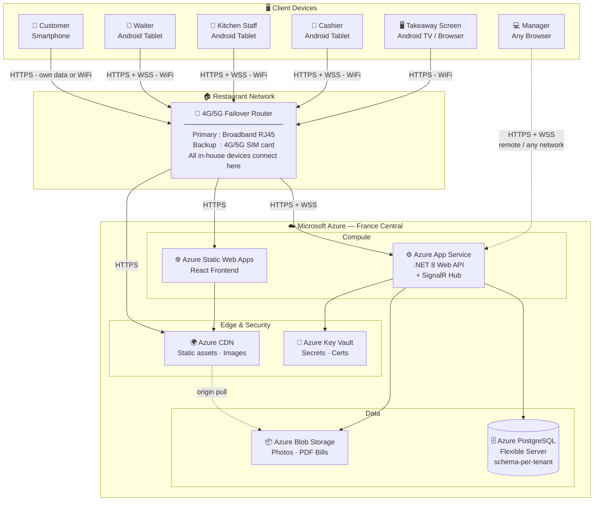

# Architecture — Deployment Diagram

```mermaid
flowchart TB
    subgraph CLIENTS["🖥️ Client Devices"]
        CUS["📱 Customer\nSmartphone"]
        WTR["📱 Waiter\nAndroid Tablet"]
        KIT["📱 Kitchen Staff\nAndroid Tablet"]
        CSH["📱 Cashier\nAndroid Tablet"]
        TV["🖥️ Takeaway Screen\nAndroid TV / Browser"]
        MGR["💻 Manager\nAny Browser"]
    end

    subgraph RESTONET["🏠 Restaurant Network"]
        ROUTER["📡 4G/5G Failover Router\n────────────────────\nPrimary : Broadband RJ45\nBackup  : 4G/5G SIM card\nAll in-house devices connect here"]
    end

    subgraph AZURE["☁️ Microsoft Azure — France Central"]
        subgraph COMPUTE["Compute"]
            API["⚙️ Azure App Service\n.NET 8 Web API\n+ SignalR Hub"]
            SWA["🌐 Azure Static Web Apps\nReact Frontend"]
        end
        subgraph DATA["Data"]
            PG[("🗄️ Azure PostgreSQL\nFlexible Server\nschema-per-tenant")]
            BLOB["📦 Azure Blob Storage\nPhotos · PDF Bills"]
        end
        subgraph EDGE["Edge & Security"]
            CDN["🌍 Azure CDN\nStatic assets · Images"]
            KV["🔐 Azure Key Vault\nSecrets · Certs"]
        end
    end

    CUS -->|"HTTPS - own data or WiFi"| ROUTER
    WTR -->|"HTTPS + WSS - WiFi"| ROUTER
    KIT -->|"HTTPS + WSS - WiFi"| ROUTER
    CSH -->|"HTTPS + WSS - WiFi"| ROUTER
    TV  -->|"HTTPS - WiFi"| ROUTER

    MGR -.->|"HTTPS + WSS\nremote / any network"| API

    ROUTER -->|"HTTPS + WSS"| API
    ROUTER -->|"HTTPS"| SWA
    ROUTER -->|"HTTPS"| CDN

    API --> PG
    API --> BLOB
    API --> KV
    SWA --> CDN
    CDN -.->|origin pull| BLOB
```
