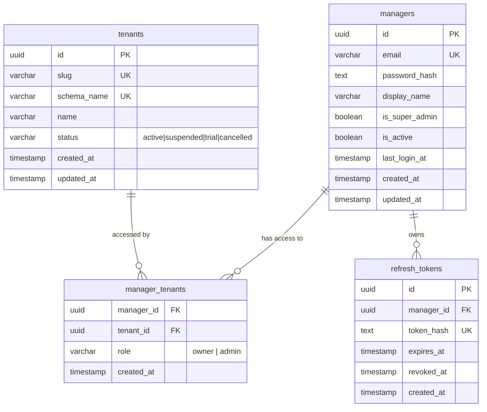

# ERD — Public (Platform) Schema

```mermaid
erDiagram
    tenants {
        uuid    id          PK
        varchar slug        UK
        varchar schema_name UK
        varchar name
        varchar status      "active|suspended|trial|cancelled"
        timestamp created_at
        timestamp updated_at
    }

    managers {
        uuid    id              PK
        varchar email           UK
        text    password_hash
        varchar display_name
        boolean is_super_admin
        boolean is_active
        timestamp last_login_at
        timestamp created_at
        timestamp updated_at
    }

    manager_tenants {
        uuid    manager_id  FK
        uuid    tenant_id   FK
        varchar role        "owner | admin"
        timestamp created_at
    }

    refresh_tokens {
        uuid    id          PK
        uuid    manager_id  FK
        text    token_hash  UK
        timestamp expires_at
        timestamp revoked_at
        timestamp created_at
    }

    managers       ||--o{ manager_tenants : "has access to"
    tenants        ||--o{ manager_tenants : "accessed by"
    managers       ||--o{ refresh_tokens  : "owns"
```
