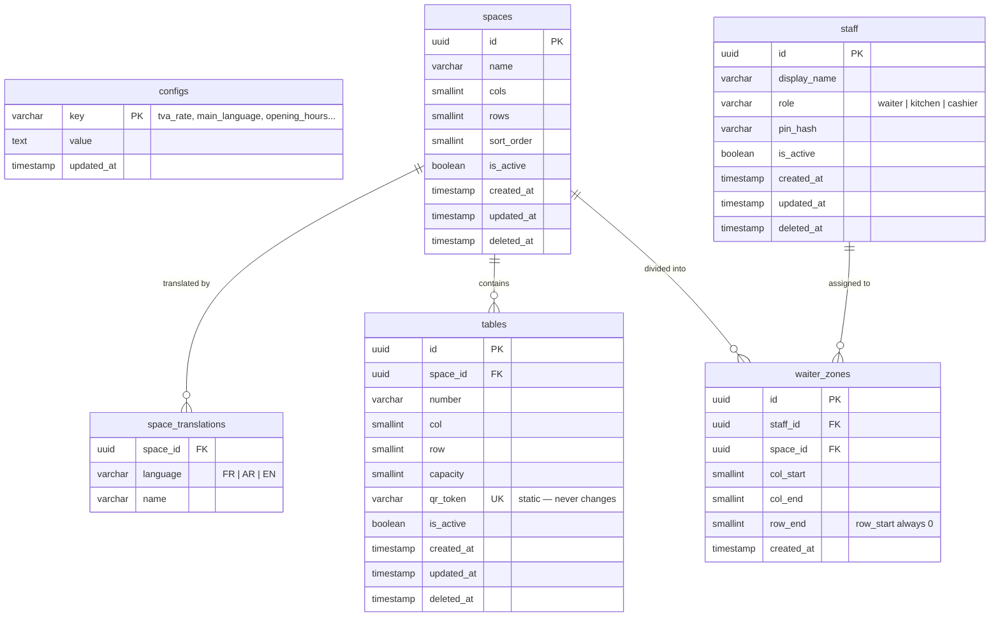

# ERD — Tenant Setup Schema

```mermaid
erDiagram
    configs {
        varchar key         PK  "tva_rate, main_language, opening_hours..."
        text    value
        timestamp updated_at
    }

    spaces {
        uuid     id          PK
        varchar  name
        smallint cols
        smallint rows
        smallint sort_order
        boolean  is_active
        timestamp created_at
        timestamp updated_at
        timestamp deleted_at
    }

    space_translations {
        uuid    space_id    FK
        varchar language    "FR | AR | EN"
        varchar name
    }

    tables {
        uuid     id          PK
        uuid     space_id    FK
        varchar  number
        smallint col
        smallint row
        smallint capacity
        varchar  qr_token    UK  "static — never changes"
        boolean  is_active
        timestamp created_at
        timestamp updated_at
        timestamp deleted_at
    }

    staff {
        uuid    id              PK
        varchar display_name
        varchar role            "waiter | kitchen | cashier"
        varchar pin_hash
        boolean is_active
        timestamp created_at
        timestamp updated_at
        timestamp deleted_at
    }

    waiter_zones {
        uuid     id          PK
        uuid     staff_id    FK
        uuid     space_id    FK
        smallint col_start
        smallint col_end
        smallint row_end    "row_start always 0"
        timestamp created_at
    }

    spaces         ||--o{ space_translations : "translated by"
    spaces         ||--o{ tables             : "contains"
    spaces         ||--o{ waiter_zones       : "divided into"
    staff          ||--o{ waiter_zones       : "assigned to"
```
