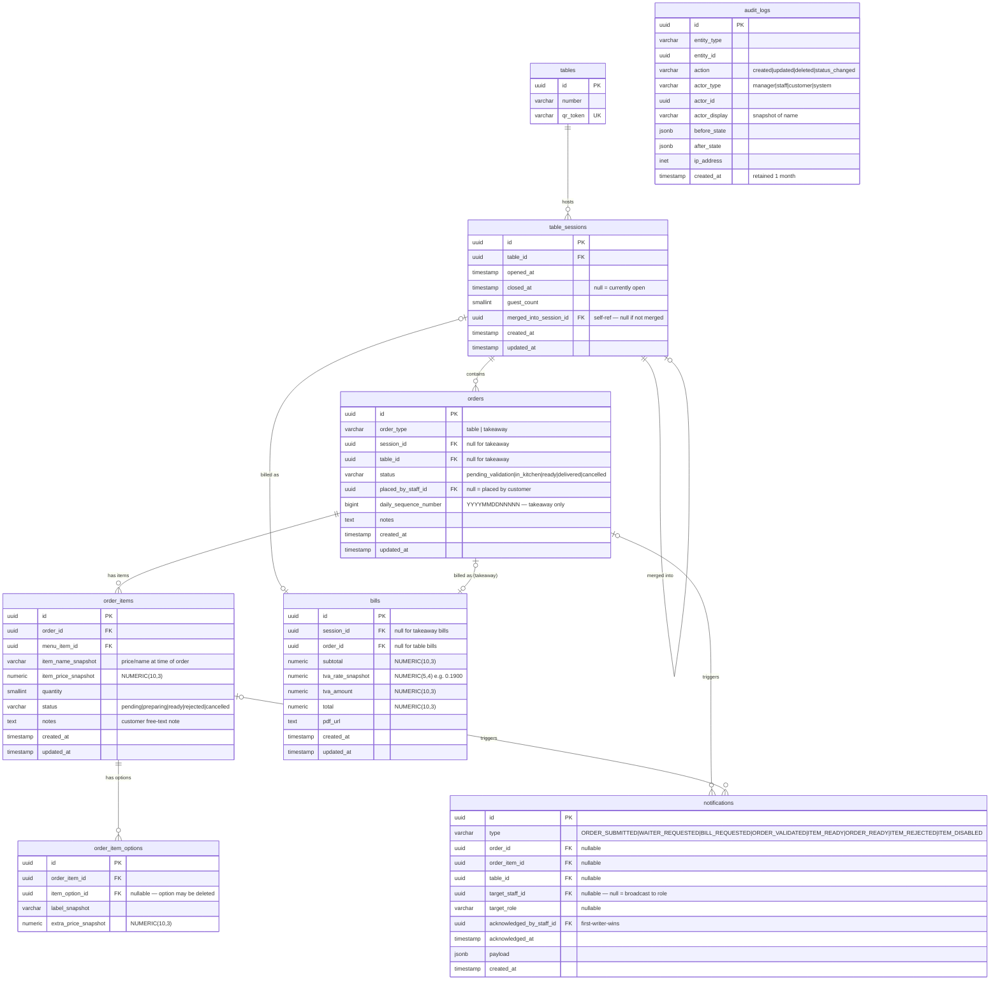

# ERD — Sessions, Orders, Bills & Notifications Schema

```mermaid
erDiagram
    tables {
        uuid    id          PK
        varchar number
        varchar qr_token    UK
    }

    table_sessions {
        uuid     id                      PK
        uuid     table_id                FK
        timestamp opened_at
        timestamp closed_at              "null = currently open"
        smallint guest_count
        uuid     merged_into_session_id  FK  "self-ref — null if not merged"
        timestamp created_at
        timestamp updated_at
    }

    orders {
        uuid    id                      PK
        varchar order_type              "table | takeaway"
        uuid    session_id              FK  "null for takeaway"
        uuid    table_id                FK  "null for takeaway"
        varchar status                  "pending_validation|in_kitchen|ready|delivered|cancelled"
        uuid    placed_by_staff_id      FK  "null = placed by customer"
        bigint  daily_sequence_number   "YYYYMMDDNNNNN — takeaway only"
        text    notes
        timestamp created_at
        timestamp updated_at
    }

    order_items {
        uuid     id                     PK
        uuid     order_id               FK
        uuid     menu_item_id           FK
        varchar  item_name_snapshot     "price/name at time of order"
        numeric  item_price_snapshot    "NUMERIC(10,3)"
        smallint quantity
        varchar  status                 "pending|preparing|ready|rejected|cancelled"
        text     notes                  "customer free-text note"
        timestamp created_at
        timestamp updated_at
    }

    order_item_options {
        uuid    id                      PK
        uuid    order_item_id           FK
        uuid    item_option_id          FK  "nullable — option may be deleted"
        varchar label_snapshot
        numeric extra_price_snapshot    "NUMERIC(10,3)"
    }

    bills {
        uuid    id                  PK
        uuid    session_id          FK  "null for takeaway bills"
        uuid    order_id            FK  "null for table bills"
        numeric subtotal            "NUMERIC(10,3)"
        numeric tva_rate_snapshot   "NUMERIC(5,4) e.g. 0.1900"
        numeric tva_amount          "NUMERIC(10,3)"
        numeric total               "NUMERIC(10,3)"
        text    pdf_url
        timestamp created_at
        timestamp updated_at
    }

    notifications {
        uuid      id                          PK
        varchar   type                        "ORDER_SUBMITTED|WAITER_REQUESTED|BILL_REQUESTED|ORDER_VALIDATED|ITEM_READY|ORDER_READY|ITEM_REJECTED|ITEM_DISABLED"
        uuid      order_id                    FK  "nullable"
        uuid      order_item_id               FK  "nullable"
        uuid      table_id                    FK  "nullable"
        uuid      target_staff_id             FK  "nullable — null = broadcast to role"
        varchar   target_role                 "nullable"
        uuid      acknowledged_by_staff_id    FK  "first-writer-wins"
        timestamp acknowledged_at
        jsonb     payload
        timestamp created_at
    }

    audit_logs {
        uuid    id              PK
        varchar entity_type
        uuid    entity_id
        varchar action          "created|updated|deleted|status_changed"
        varchar actor_type      "manager|staff|customer|system"
        uuid    actor_id
        varchar actor_display   "snapshot of name"
        jsonb   before_state
        jsonb   after_state
        inet    ip_address
        timestamp created_at   "retained 1 month"
    }

    tables              ||--o{ table_sessions  : "hosts"
    table_sessions      ||--o| table_sessions  : "merged into"
    table_sessions      ||--o{ orders          : "contains"
    orders              ||--o{ order_items     : "has items"
    order_items         ||--o{ order_item_options : "has options"
    table_sessions      |o--o| bills           : "billed as"
    orders              |o--o| bills           : "billed as (takeaway)"
    orders              |o--o{ notifications   : "triggers"
    order_items         |o--o{ notifications   : "triggers"
```
