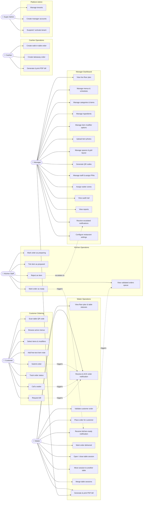

# Use Case Diagram

```mermaid
flowchart LR
    CUS(["👤 Customer"])
    WTR(["👤 Waiter"])
    KIT(["👤 Kitchen Staff"])
    CSH(["👤 Cashier"])
    MGR(["👤 Manager"])
    SA(["👤 Super Admin"])

    subgraph ORDERING["Customer Ordering"]
        UC1["Scan table QR code"]
        UC2["Browse active menus"]
        UC3["Select items & modifiers"]
        UC4["Add free-text item note"]
        UC5["Submit order"]
        UC6["Track order status"]
        UC7["Call a waiter"]
        UC8["Request bill"]
    end

    subgraph WAITER["Waiter Operations"]
        UC10["View floor plan & table statuses"]
        UC11["Receive & ACK order notification"]
        UC12["Validate customer order"]
        UC13["Place order for customer"]
        UC14["Receive kitchen-ready notification"]
        UC15["Mark order delivered"]
        UC16["Open / close table session"]
        UC17["Move session to another table"]
        UC18["Merge table sessions"]
        UC19["Generate & print PDF bill"]
    end

    subgraph KITCHEN["Kitchen Operations"]
        UC30["View validated orders queue"]
        UC31["Mark order as preparing"]
        UC32["Tick item as prepared"]
        UC33["Mark order as ready"]
        UC34["Reject an item"]
    end

    subgraph CASHIER["Cashier Operations"]
        UC40["Create walk-in table order"]
        UC41["Create takeaway order"]
        UC42["Generate & print PDF bill"]
    end

    subgraph MANAGER["Manager Dashboard"]
        UC50["View live floor plan"]
        UC51["Manage menus & schedules"]
        UC52["Manage categories & items"]
        UC53["Manage ingredients"]
        UC54["Manage item modifier options"]
        UC55["Upload item photos"]
        UC56["Manage spaces & grid layout"]
        UC57["Generate QR codes"]
        UC58["Manage staff & assign PINs"]
        UC59["Assign waiter zones"]
        UC60["View audit trail"]
        UC61["View reports"]
        UC62["Receive escalated notifications"]
        UC63["Configure restaurant settings"]
    end

    subgraph PLATFORM["Platform Admin"]
        UC70["Manage tenants"]
        UC71["Create manager accounts"]
        UC72["Suspend / activate tenant"]
    end

    CUS --> UC1 & UC2 & UC3 & UC4 & UC5 & UC6 & UC7 & UC8
    WTR --> UC10 & UC11 & UC12 & UC13 & UC14 & UC15 & UC16 & UC17 & UC18 & UC19
    KIT --> UC30 & UC31 & UC32 & UC33 & UC34
    CSH --> UC40 & UC41 & UC42
    MGR --> UC50 & UC51 & UC52 & UC53 & UC54 & UC55 & UC56 & UC57 & UC58 & UC59 & UC60 & UC61 & UC62 & UC63 & UC19
    SA  --> UC70 & UC71 & UC72

    UC5  -.->|triggers| UC11
    UC7  -.->|triggers| UC11
    UC8  -.->|triggers| UC11
    UC12 -.->|triggers| UC30
    UC33 -.->|triggers| UC14
    UC34 -.->|escalates to| UC62
```
