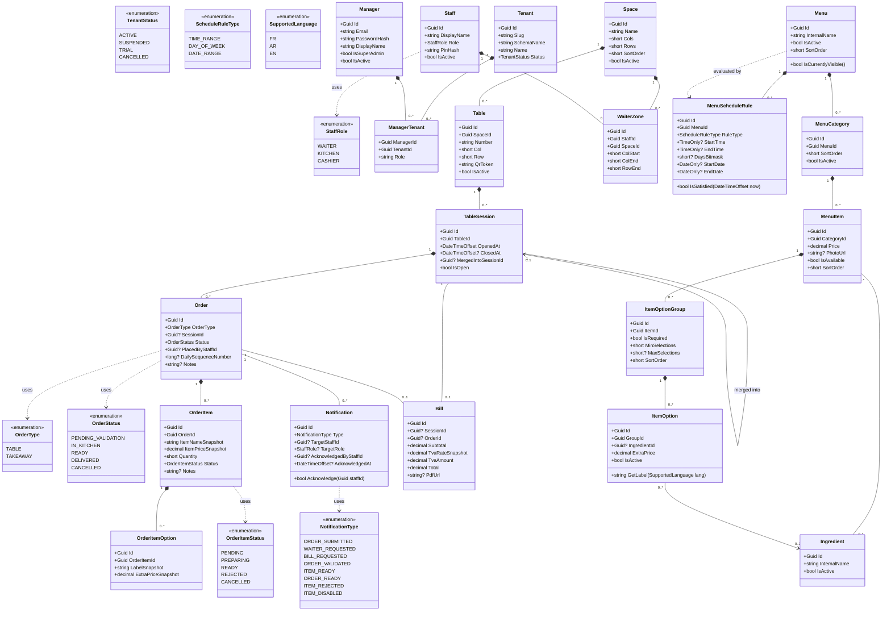

# Domain Class Diagram

```mermaid
classDiagram
    %% ── Enums ──────────────────────────────────────────────────────
    class TenantStatus {
        <<enumeration>>
        ACTIVE
        SUSPENDED
        TRIAL
        CANCELLED
    }
    class StaffRole {
        <<enumeration>>
        WAITER
        KITCHEN
        CASHIER
    }
    class OrderType {
        <<enumeration>>
        TABLE
        TAKEAWAY
    }
    class OrderStatus {
        <<enumeration>>
        PENDING_VALIDATION
        IN_KITCHEN
        READY
        DELIVERED
        CANCELLED
    }
    class OrderItemStatus {
        <<enumeration>>
        PENDING
        PREPARING
        READY
        REJECTED
        CANCELLED
    }
    class NotificationType {
        <<enumeration>>
        ORDER_SUBMITTED
        WAITER_REQUESTED
        BILL_REQUESTED
        ORDER_VALIDATED
        ITEM_READY
        ORDER_READY
        ITEM_REJECTED
        ITEM_DISABLED
    }
    class ScheduleRuleType {
        <<enumeration>>
        TIME_RANGE
        DAY_OF_WEEK
        DATE_RANGE
    }
    class SupportedLanguage {
        <<enumeration>>
        FR
        AR
        EN
    }

    %% ── Platform ────────────────────────────────────────────────────
    class Tenant {
        +Guid Id
        +string Slug
        +string SchemaName
        +string Name
        +TenantStatus Status
    }
    class Manager {
        +Guid Id
        +string Email
        +string PasswordHash
        +string DisplayName
        +bool IsSuperAdmin
        +bool IsActive
    }
    class ManagerTenant {
        +Guid ManagerId
        +Guid TenantId
        +string Role
    }

    %% ── Restaurant Setup ────────────────────────────────────────────
    class Space {
        +Guid Id
        +string Name
        +short Cols
        +short Rows
        +short SortOrder
        +bool IsActive
    }
    class Table {
        +Guid Id
        +Guid SpaceId
        +string Number
        +short Col
        +short Row
        +string QrToken
        +bool IsActive
    }
    class Staff {
        +Guid Id
        +string DisplayName
        +StaffRole Role
        +string PinHash
        +bool IsActive
    }
    class WaiterZone {
        +Guid Id
        +Guid StaffId
        +Guid SpaceId
        +short ColStart
        +short ColEnd
        +short RowEnd
    }

    %% ── Menus ───────────────────────────────────────────────────────
    class Menu {
        +Guid Id
        +string InternalName
        +bool IsActive
        +short SortOrder
        +bool IsCurrentlyVisible()
    }
    class MenuScheduleRule {
        +Guid Id
        +Guid MenuId
        +ScheduleRuleType RuleType
        +TimeOnly? StartTime
        +TimeOnly? EndTime
        +short? DaysBitmask
        +DateOnly? StartDate
        +DateOnly? EndDate
        +bool IsSatisfied(DateTimeOffset now)
    }
    class MenuCategory {
        +Guid Id
        +Guid MenuId
        +short SortOrder
        +bool IsActive
    }
    class MenuItem {
        +Guid Id
        +Guid CategoryId
        +decimal Price
        +string? PhotoUrl
        +bool IsAvailable
        +short SortOrder
    }
    class Ingredient {
        +Guid Id
        +string InternalName
        +bool IsActive
    }
    class ItemOptionGroup {
        +Guid Id
        +Guid ItemId
        +bool IsRequired
        +short MinSelections
        +short? MaxSelections
        +short SortOrder
    }
    class ItemOption {
        +Guid Id
        +Guid GroupId
        +Guid? IngredientId
        +decimal ExtraPrice
        +bool IsActive
        +string GetLabel(SupportedLanguage lang)
    }

    %% ── Sessions & Orders ───────────────────────────────────────────
    class TableSession {
        +Guid Id
        +Guid TableId
        +DateTimeOffset OpenedAt
        +DateTimeOffset? ClosedAt
        +Guid? MergedIntoSessionId
        +bool IsOpen
    }
    class Order {
        +Guid Id
        +OrderType OrderType
        +Guid? SessionId
        +OrderStatus Status
        +Guid? PlacedByStaffId
        +long? DailySequenceNumber
        +string? Notes
    }
    class OrderItem {
        +Guid Id
        +Guid OrderId
        +string ItemNameSnapshot
        +decimal ItemPriceSnapshot
        +short Quantity
        +OrderItemStatus Status
        +string? Notes
    }
    class OrderItemOption {
        +Guid Id
        +Guid OrderItemId
        +string LabelSnapshot
        +decimal ExtraPriceSnapshot
    }
    class Bill {
        +Guid Id
        +Guid? SessionId
        +Guid? OrderId
        +decimal Subtotal
        +decimal TvaRateSnapshot
        +decimal TvaAmount
        +decimal Total
        +string? PdfUrl
    }
    class Notification {
        +Guid Id
        +NotificationType Type
        +Guid? TargetStaffId
        +StaffRole? TargetRole
        +Guid? AcknowledgedByStaffId
        +DateTimeOffset? AcknowledgedAt
        +bool Acknowledge(Guid staffId)
    }

    %% ── Relationships ───────────────────────────────────────────────
    Tenant        "1" *-- "0..*" ManagerTenant
    Manager       "1" *-- "0..*" ManagerTenant

    Space         "1" *-- "0..*" Table
    Space         "1" *-- "0..*" WaiterZone
    Staff         "1" *-- "0..*" WaiterZone

    Menu          "1" *-- "0..*" MenuScheduleRule
    Menu          "1" *-- "0..*" MenuCategory
    MenuCategory  "1" *-- "0..*" MenuItem
    MenuItem      "0..*" -- "0..*" Ingredient
    MenuItem      "1" *-- "0..*" ItemOptionGroup
    ItemOptionGroup "1" *-- "0..*" ItemOption
    ItemOption    "0..*" --> "0..1" Ingredient

    Table         "1" *-- "0..*" TableSession
    TableSession  "1" *-- "0..*" Order
    TableSession  "1" --> "0..1" TableSession : merged into
    Order         "1" *-- "0..*" OrderItem
    OrderItem     "1" *-- "0..*" OrderItemOption
    TableSession  "1" -- "0..1" Bill
    Order         "1" -- "0..1" Bill
    Order         "1" -- "0..*" Notification

    Order       ..> OrderStatus       : uses
    Order       ..> OrderType         : uses
    OrderItem   ..> OrderItemStatus   : uses
    Staff       ..> StaffRole         : uses
    Menu        ..> MenuScheduleRule  : evaluated by
    Notification ..> NotificationType : uses
```
