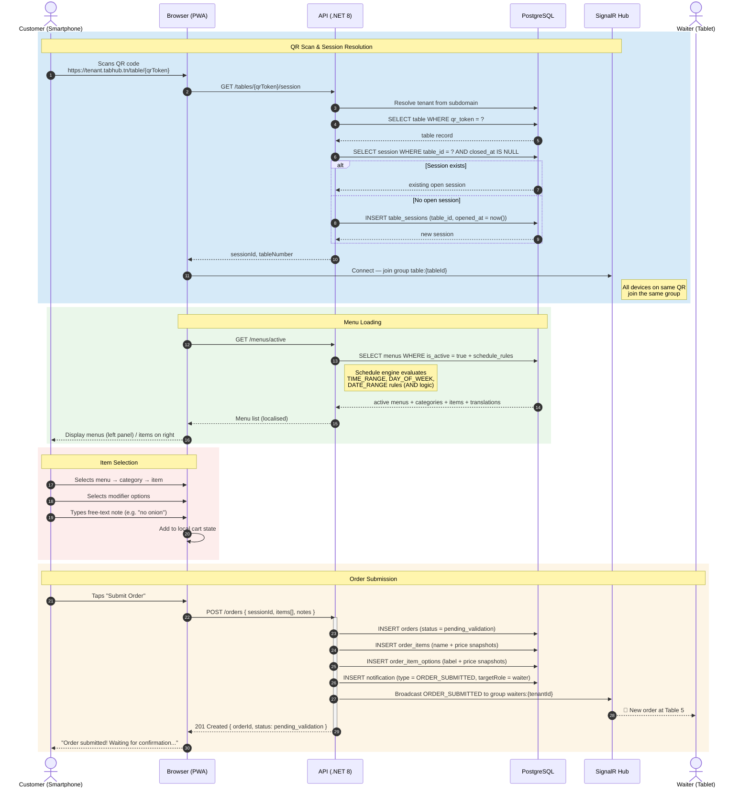

# Sequence — QR Scan to Order Submitted

```mermaid
sequenceDiagram
    autonumber
    actor CUS as Customer (Smartphone)
    participant BRW as Browser (PWA)
    participant API as API (.NET 8)
    participant DB  as PostgreSQL
    participant HUB as SignalR Hub
    actor WTR as Waiter (Tablet)

    rect rgb(214, 234, 248)
        Note over CUS,HUB: QR Scan & Session Resolution
        CUS->>BRW: Scans QR code<br/>https://tenant.tabhub.tn/table/{qrToken}
        BRW->>API: GET /tables/{qrToken}/session
        API->>DB: Resolve tenant from subdomain
        API->>DB: SELECT table WHERE qr_token = ?
        DB-->>API: table record
        API->>DB: SELECT session WHERE table_id = ? AND closed_at IS NULL
        alt Session exists
            DB-->>API: existing open session
        else No open session
            API->>DB: INSERT table_sessions (table_id, opened_at = now())
            DB-->>API: new session
        end
        API-->>BRW: sessionId, tableNumber
        BRW->>HUB: Connect — join group table:{tableId}
        Note right of HUB: All devices on same QR<br/>join the same group
    end

    rect rgb(234, 247, 234)
        Note over BRW,DB: Menu Loading
        BRW->>API: GET /menus/active
        API->>DB: SELECT menus WHERE is_active = true + schedule_rules
        Note right of API: Schedule engine evaluates<br/>TIME_RANGE, DAY_OF_WEEK,<br/>DATE_RANGE rules (AND logic)
        DB-->>API: active menus + categories + items + translations
        API-->>BRW: Menu list (localised)
        BRW-->>CUS: Display menus (left panel) / items on right
    end

    rect rgb(253, 237, 236)
        Note over CUS,BRW: Item Selection
        CUS->>BRW: Selects menu → category → item
        CUS->>BRW: Selects modifier options
        CUS->>BRW: Types free-text note (e.g. "no onion")
        BRW->>BRW: Add to local cart state
    end

    rect rgb(253, 245, 230)
        Note over CUS,WTR: Order Submission
        CUS->>BRW: Taps "Submit Order"
        BRW->>API: POST /orders { sessionId, items[], notes }
        activate API
        API->>DB: INSERT orders (status = pending_validation)
        API->>DB: INSERT order_items (name + price snapshots)
        API->>DB: INSERT order_item_options (label + price snapshots)
        API->>DB: INSERT notification (type = ORDER_SUBMITTED, targetRole = waiter)
        API->>HUB: Broadcast ORDER_SUBMITTED to group waiters:{tenantId}
        HUB-->>WTR: 🔔 New order at Table 5
        API-->>BRW: 201 Created { orderId, status: pending_validation }
        deactivate API
        BRW-->>CUS: "Order submitted! Waiting for confirmation..."
    end
```
