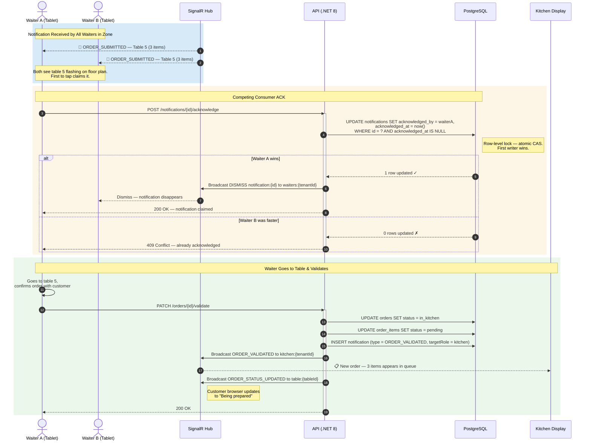

# Sequence — Waiter Validates Order

```mermaid
sequenceDiagram
    autonumber
    actor WTRA as Waiter A (Tablet)
    actor WTRB as Waiter B (Tablet)
    participant HUB as SignalR Hub
    participant API as API (.NET 8)
    participant DB  as PostgreSQL
    participant KIT as Kitchen Display

    rect rgb(214, 234, 248)
        Note over WTRA,WTRB: Notification Received by All Waiters in Zone
        HUB-->>WTRA: 🔔 ORDER_SUBMITTED — Table 5 (3 items)
        HUB-->>WTRB: 🔔 ORDER_SUBMITTED — Table 5 (3 items)
        Note over WTRA,WTRB: Both see table 5 flashing on floor plan.<br/>First to tap claims it.
    end

    rect rgb(253, 245, 230)
        Note over WTRA,DB: Competing Consumer ACK
        WTRA->>API: POST /notifications/{id}/acknowledge
        activate API
        API->>DB: UPDATE notifications SET acknowledged_by = waiterA,<br/>acknowledged_at = now()<br/>WHERE id = ? AND acknowledged_at IS NULL
        Note right of DB: Row-level lock — atomic CAS.<br/>First writer wins.
        alt Waiter A wins
            DB-->>API: 1 row updated ✓
            API->>HUB: Broadcast DISMISS notification:{id} to waiters:{tenantId}
            HUB-->>WTRB: Dismiss — notification disappears
            API-->>WTRA: 200 OK — notification claimed
        else Waiter B was faster
            DB-->>API: 0 rows updated ✗
            API-->>WTRA: 409 Conflict — already acknowledged
        end
        deactivate API
    end

    rect rgb(234, 247, 234)
        Note over WTRA,KIT: Waiter Goes to Table & Validates
        WTRA->>WTRA: Goes to table 5,<br/>confirms order with customer
        WTRA->>API: PATCH /orders/{id}/validate
        activate API
        API->>DB: UPDATE orders SET status = in_kitchen
        API->>DB: UPDATE order_items SET status = pending
        API->>DB: INSERT notification (type = ORDER_VALIDATED, targetRole = kitchen)
        API->>HUB: Broadcast ORDER_VALIDATED to kitchen:{tenantId}
        HUB-->>KIT: 📋 New order — 3 items appears in queue
        API->>HUB: Broadcast ORDER_STATUS_UPDATED to table:{tableId}
        Note right of HUB: Customer browser updates<br/>to "Being prepared"
        API-->>WTRA: 200 OK
        deactivate API
    end
```
