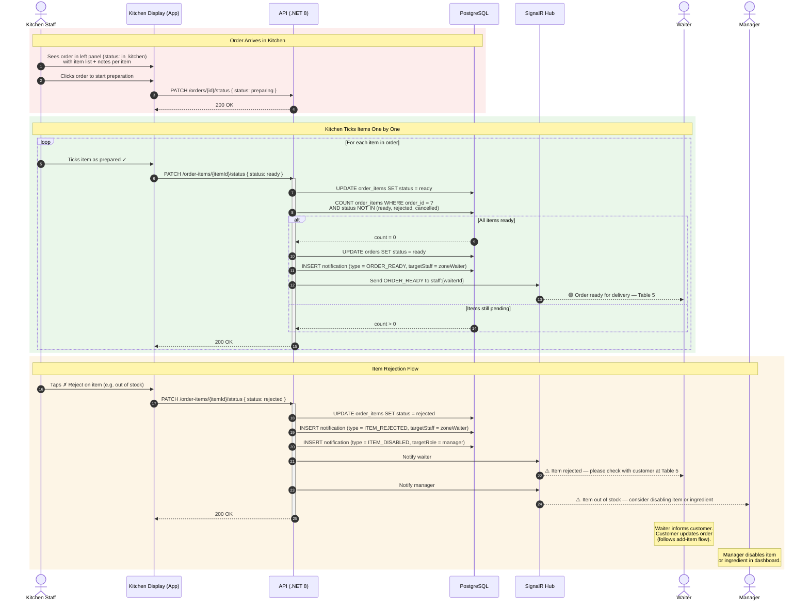

# Sequence — Kitchen Flow

```mermaid
sequenceDiagram
    autonumber
    actor KIT    as Kitchen Staff
    participant KITAPP as Kitchen Display (App)
    participant API    as API (.NET 8)
    participant DB     as PostgreSQL
    participant HUB    as SignalR Hub
    actor WTR    as Waiter
    actor MGR    as Manager

    rect rgb(253, 237, 236)
        Note over KIT,DB: Order Arrives in Kitchen
        KIT->>KITAPP: Sees order in left panel (status: in_kitchen)<br/>with item list + notes per item
        KIT->>KITAPP: Clicks order to start preparation
        KITAPP->>API: PATCH /orders/{id}/status { status: preparing }
        API-->>KITAPP: 200 OK
    end

    rect rgb(234, 247, 234)
        Note over KIT,WTR: Kitchen Ticks Items One by One
        loop For each item in order
            KIT->>KITAPP: Ticks item as prepared ✓
            KITAPP->>API: PATCH /order-items/{itemId}/status { status: ready }
            activate API
            API->>DB: UPDATE order_items SET status = ready
            API->>DB: COUNT order_items WHERE order_id = ?<br/>AND status NOT IN (ready, rejected, cancelled)
            alt All items ready
                DB-->>API: count = 0
                API->>DB: UPDATE orders SET status = ready
                API->>DB: INSERT notification (type = ORDER_READY, targetStaff = zoneWaiter)
                API->>HUB: Send ORDER_READY to staff:{waiterId}
                HUB-->>WTR: 🟢 Order ready for delivery — Table 5
            else Items still pending
                DB-->>API: count > 0
            end
            API-->>KITAPP: 200 OK
            deactivate API
        end
    end

    rect rgb(253, 245, 230)
        Note over KIT,MGR: Item Rejection Flow
        KIT->>KITAPP: Taps ✗ Reject on item (e.g. out of stock)
        KITAPP->>API: PATCH /order-items/{itemId}/status { status: rejected }
        activate API
        API->>DB: UPDATE order_items SET status = rejected
        API->>DB: INSERT notification (type = ITEM_REJECTED, targetStaff = zoneWaiter)
        API->>DB: INSERT notification (type = ITEM_DISABLED, targetRole = manager)
        API->>HUB: Notify waiter
        HUB-->>WTR: ⚠️ Item rejected — please check with customer at Table 5
        API->>HUB: Notify manager
        HUB-->>MGR: ⚠️ Item out of stock — consider disabling item or ingredient
        API-->>KITAPP: 200 OK
        deactivate API
        Note over WTR: Waiter informs customer.<br/>Customer updates order<br/>(follows add-item flow).
        Note over MGR: Manager disables item<br/>or ingredient in dashboard.
    end
```
