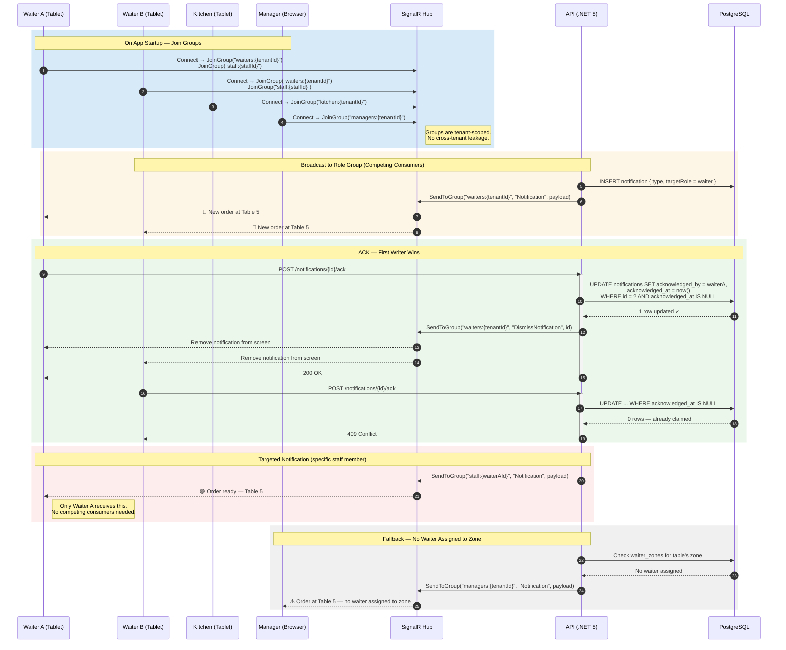

# Sequence — SignalR Group Structure & Notification ACK

```mermaid
sequenceDiagram
    autonumber
    participant WTRA as Waiter A (Tablet)
    participant WTRB as Waiter B (Tablet)
    participant KIT  as Kitchen (Tablet)
    participant MGR  as Manager (Browser)
    participant HUB  as SignalR Hub
    participant API  as API (.NET 8)
    participant DB   as PostgreSQL

    rect rgb(214, 234, 248)
        Note over WTRA,MGR: On App Startup — Join Groups
        WTRA->>HUB: Connect → JoinGroup("waiters:{tenantId}")<br/>JoinGroup("staff:{staffId}")
        WTRB->>HUB: Connect → JoinGroup("waiters:{tenantId}")<br/>JoinGroup("staff:{staffId}")
        KIT->>HUB:  Connect → JoinGroup("kitchen:{tenantId}")
        MGR->>HUB:  Connect → JoinGroup("managers:{tenantId}")
        Note right of HUB: Groups are tenant-scoped.<br/>No cross-tenant leakage.
    end

    rect rgb(253, 245, 230)
        Note over API,WTRB: Broadcast to Role Group (Competing Consumers)
        API->>DB: INSERT notification { type, targetRole = waiter }
        API->>HUB: SendToGroup("waiters:{tenantId}", "Notification", payload)
        HUB-->>WTRA: 🔔 New order at Table 5
        HUB-->>WTRB: 🔔 New order at Table 5
    end

    rect rgb(234, 247, 234)
        Note over WTRA,DB: ACK — First Writer Wins
        WTRA->>API: POST /notifications/{id}/ack
        activate API
        API->>DB: UPDATE notifications SET acknowledged_by = waiterA,<br/>acknowledged_at = now()<br/>WHERE id = ? AND acknowledged_at IS NULL
        DB-->>API: 1 row updated ✓
        API->>HUB: SendToGroup("waiters:{tenantId}", "DismissNotification", id)
        HUB-->>WTRA: Remove notification from screen
        HUB-->>WTRB: Remove notification from screen
        API-->>WTRA: 200 OK
        deactivate API

        WTRB->>API: POST /notifications/{id}/ack
        activate API
        API->>DB: UPDATE ... WHERE acknowledged_at IS NULL
        DB-->>API: 0 rows — already claimed
        API-->>WTRB: 409 Conflict
        deactivate API
    end

    rect rgb(253, 237, 236)
        Note over API,WTRA: Targeted Notification (specific staff member)
        API->>HUB: SendToGroup("staff:{waiterAId}", "Notification", payload)
        HUB-->>WTRA: 🟢 Order ready — Table 5
        Note right of WTRA: Only Waiter A receives this.<br/>No competing consumers needed.
    end

    rect rgb(240, 240, 240)
        Note over API,MGR: Fallback — No Waiter Assigned to Zone
        API->>DB: Check waiter_zones for table's zone
        DB-->>API: No waiter assigned
        API->>HUB: SendToGroup("managers:{tenantId}", "Notification", payload)
        HUB-->>MGR: ⚠️ Order at Table 5 — no waiter assigned to zone
    end
```
