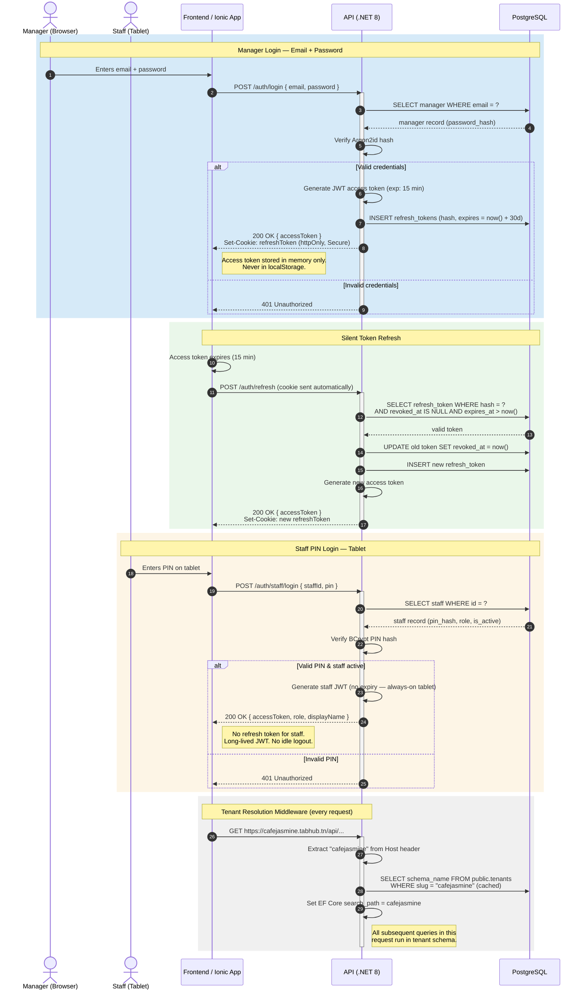

# Sequence — Authentication Flows

```mermaid
sequenceDiagram
    autonumber
    actor MGR as Manager (Browser)
    actor STF as Staff (Tablet)
    participant APP as Frontend / Ionic App
    participant API as API (.NET 8)
    participant DB  as PostgreSQL

    rect rgb(214, 234, 248)
        Note over MGR,DB: Manager Login — Email + Password
        MGR->>APP: Enters email + password
        APP->>API: POST /auth/login { email, password }
        activate API
        API->>DB: SELECT manager WHERE email = ?
        DB-->>API: manager record (password_hash)
        API->>API: Verify Argon2id hash
        alt Valid credentials
            API->>API: Generate JWT access token (exp: 15 min)
            API->>DB: INSERT refresh_tokens (hash, expires = now() + 30d)
            API-->>APP: 200 OK { accessToken }<br/>Set-Cookie: refreshToken (httpOnly, Secure)
            Note right of APP: Access token stored in memory only.<br/>Never in localStorage.
        else Invalid credentials
            API-->>APP: 401 Unauthorized
        end
        deactivate API
    end

    rect rgb(234, 247, 234)
        Note over APP,DB: Silent Token Refresh
        APP->>APP: Access token expires (15 min)
        APP->>API: POST /auth/refresh (cookie sent automatically)
        activate API
        API->>DB: SELECT refresh_token WHERE hash = ?<br/>AND revoked_at IS NULL AND expires_at > now()
        DB-->>API: valid token
        API->>DB: UPDATE old token SET revoked_at = now()
        API->>DB: INSERT new refresh_token
        API->>API: Generate new access token
        API-->>APP: 200 OK { accessToken }<br/>Set-Cookie: new refreshToken
        deactivate API
    end

    rect rgb(253, 245, 230)
        Note over STF,DB: Staff PIN Login — Tablet
        STF->>APP: Enters PIN on tablet
        APP->>API: POST /auth/staff/login { staffId, pin }
        activate API
        API->>DB: SELECT staff WHERE id = ?
        DB-->>API: staff record (pin_hash, role, is_active)
        API->>API: Verify BCrypt PIN hash
        alt Valid PIN & staff active
            API->>API: Generate staff JWT (no expiry — always-on tablet)
            API-->>APP: 200 OK { accessToken, role, displayName }
            Note right of APP: No refresh token for staff.<br/>Long-lived JWT. No idle logout.
        else Invalid PIN
            API-->>APP: 401 Unauthorized
        end
        deactivate API
    end

    rect rgb(240, 240, 240)
        Note over APP,API: Tenant Resolution Middleware (every request)
        APP->>API: GET https://cafejasmine.tabhub.tn/api/...
        activate API
        API->>API: Extract "cafejasmine" from Host header
        API->>DB: SELECT schema_name FROM public.tenants<br/>WHERE slug = "cafejasmine" (cached)
        API->>API: Set EF Core search_path = cafejasmine
        Note right of API: All subsequent queries in this<br/>request run in tenant schema.
        deactivate API
    end
```
