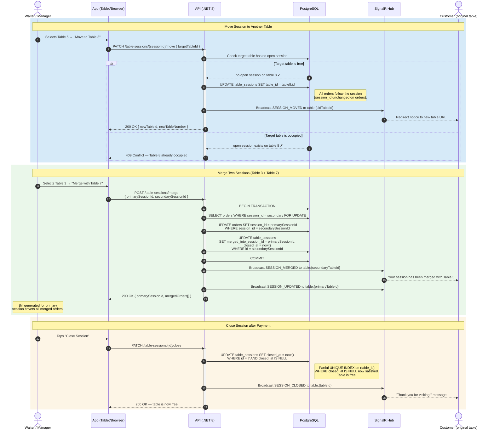

# Sequence — Table Session Operations

```mermaid
sequenceDiagram
    autonumber
    actor USR  as Waiter / Manager
    participant APP as App (Tablet/Browser)
    participant API as API (.NET 8)
    participant DB  as PostgreSQL
    participant HUB as SignalR Hub
    actor CUS  as Customer (original table)

    rect rgb(214, 234, 248)
        Note over USR,CUS: Move Session to Another Table
        USR->>APP: Selects Table 5 → "Move to Table 8"
        APP->>API: PATCH /table-sessions/{sessionId}/move { targetTableId }
        activate API
        API->>DB: Check target table has no open session
        alt Target table is free
            DB-->>API: no open session on table 8 ✓
            API->>DB: UPDATE table_sessions SET table_id = table8.id
            Note right of DB: All orders follow the session<br/>(session_id unchanged on orders).
            API->>HUB: Broadcast SESSION_MOVED to table:{oldTableId}
            HUB-->>CUS: Redirect notice to new table URL
            API-->>APP: 200 OK { newTableId, newTableNumber }
        else Target table is occupied
            DB-->>API: open session exists on table 8 ✗
            API-->>APP: 409 Conflict — Table 8 already occupied
        end
        deactivate API
    end

    rect rgb(234, 247, 234)
        Note over USR,CUS: Merge Two Sessions (Table 3 + Table 7)
        USR->>APP: Selects Table 3 → "Merge with Table 7"
        APP->>API: POST /table-sessions/merge<br/>{ primarySessionId, secondarySessionId }
        activate API
        API->>DB: BEGIN TRANSACTION
        API->>DB: SELECT orders WHERE session_id = secondary FOR UPDATE
        API->>DB: UPDATE orders SET session_id = primarySessionId<br/>WHERE session_id = secondarySessionId
        API->>DB: UPDATE table_sessions<br/>SET merged_into_session_id = primarySessionId,<br/>closed_at = now()<br/>WHERE id = secondarySessionId
        API->>DB: COMMIT
        API->>HUB: Broadcast SESSION_MERGED to table:{secondaryTableId}
        HUB-->>CUS: Your session has been merged with Table 3
        API->>HUB: Broadcast SESSION_UPDATED to table:{primaryTableId}
        API-->>APP: 200 OK { primarySessionId, mergedOrders[] }
        deactivate API
        Note over USR: Bill generated for primary<br/>session covers all merged orders.
    end

    rect rgb(253, 245, 230)
        Note over USR,CUS: Close Session after Payment
        USR->>APP: Taps "Close Session"
        APP->>API: PATCH /table-sessions/{id}/close
        activate API
        API->>DB: UPDATE table_sessions SET closed_at = now()<br/>WHERE id = ? AND closed_at IS NULL
        Note right of DB: Partial UNIQUE INDEX on (table_id)<br/>WHERE closed_at IS NULL now satisfied.<br/>Table is free.
        API->>HUB: Broadcast SESSION_CLOSED to table:{tableId}
        HUB-->>CUS: "Thank you for visiting!" message
        API-->>APP: 200 OK — table is now free
        deactivate API
    end
```
