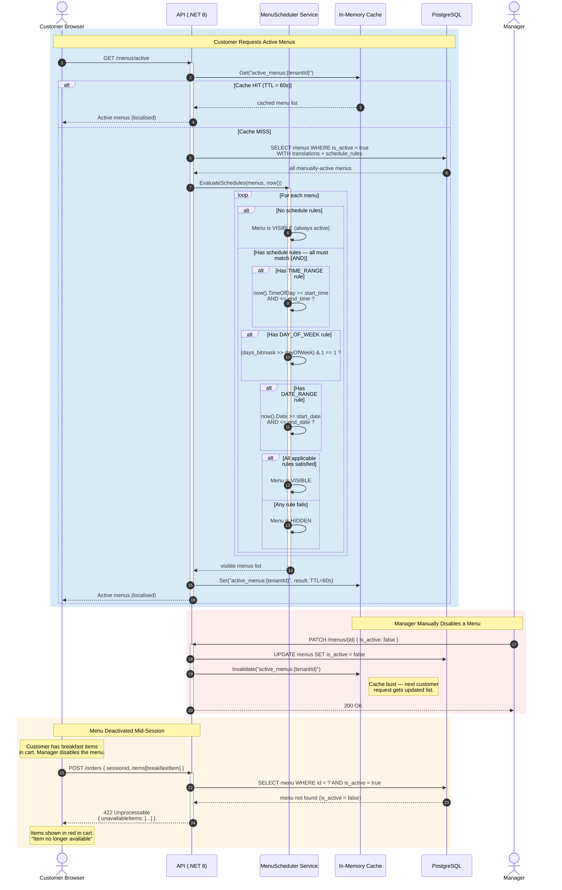

# Sequence — Menu Scheduling Engine

```mermaid
sequenceDiagram
    autonumber
    actor CUS  as Customer Browser
    participant API   as API (.NET 8)
    participant SVC   as MenuScheduler Service
    participant CACHE as In-Memory Cache
    participant DB    as PostgreSQL
    actor MGR  as Manager

    rect rgb(214, 234, 248)
        Note over CUS,DB: Customer Requests Active Menus
        CUS->>API: GET /menus/active
        activate API
        API->>CACHE: Get("active_menus:{tenantId}")
        alt Cache HIT (TTL = 60s)
            CACHE-->>API: cached menu list
            API-->>CUS: Active menus (localised)
        else Cache MISS
            API->>DB: SELECT menus WHERE is_active = true<br/>WITH translations + schedule_rules
            DB-->>API: all manually-active menus

            API->>SVC: EvaluateSchedules(menus, now())
            activate SVC
            loop For each menu
                alt No schedule rules
                    SVC->>SVC: Menu is VISIBLE (always active)
                else Has schedule rules — all must match (AND)
                    alt Has TIME_RANGE rule
                        SVC->>SVC: now().TimeOfDay >= start_time<br/>AND <= end_time ?
                    end
                    alt Has DAY_OF_WEEK rule
                        SVC->>SVC: (days_bitmask >> dayOfWeek) & 1 == 1 ?
                    end
                    alt Has DATE_RANGE rule
                        SVC->>SVC: now().Date >= start_date<br/>AND <= end_date ?
                    end
                    alt All applicable rules satisfied
                        SVC->>SVC: Menu is VISIBLE
                    else Any rule fails
                        SVC->>SVC: Menu is HIDDEN
                    end
                end
            end
            SVC-->>API: visible menus list
            deactivate SVC

            API->>CACHE: Set("active_menus:{tenantId}", result, TTL=60s)
            API-->>CUS: Active menus (localised)
        end
        deactivate API
    end

    rect rgb(253, 237, 236)
        Note over MGR,CACHE: Manager Manually Disables a Menu
        MGR->>API: PATCH /menus/{id} { is_active: false }
        activate API
        API->>DB: UPDATE menus SET is_active = false
        API->>CACHE: Invalidate("active_menus:{tenantId}")
        Note right of CACHE: Cache bust — next customer<br/>request gets updated list.
        API-->>MGR: 200 OK
        deactivate API
    end

    rect rgb(253, 245, 230)
        Note over CUS,API: Menu Deactivated Mid-Session
        Note over CUS: Customer has breakfast items<br/>in cart. Manager disables the menu.
        CUS->>API: POST /orders { sessionId, items[breakfastItem] }
        activate API
        API->>DB: SELECT menu WHERE id = ? AND is_active = true
        DB-->>API: menu not found (is_active = false)
        API-->>CUS: 422 Unprocessable<br/>{ unavailableItems: [...] }
        deactivate API
        Note over CUS: Items shown in red in cart.<br/>"Item no longer available"
    end
```
