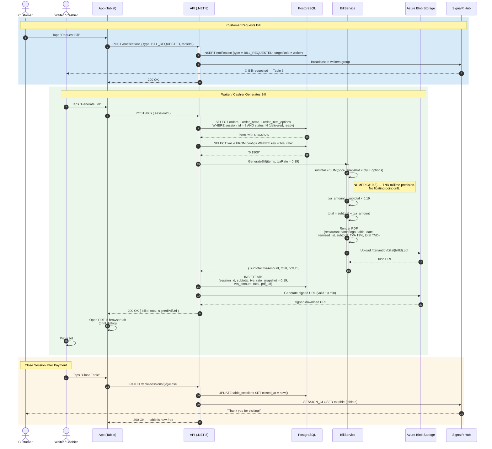

# Sequence — PDF Bill Generation

```mermaid
sequenceDiagram
    autonumber
    actor CUS  as Customer
    actor USR  as Waiter / Cashier
    participant APP  as App (Tablet)
    participant API  as API (.NET 8)
    participant DB   as PostgreSQL
    participant BILL as BillService
    participant BLOB as Azure Blob Storage
    participant HUB  as SignalR Hub

    rect rgb(214, 234, 248)
        Note over CUS,HUB: Customer Requests Bill
        CUS->>APP: Taps "Request Bill"
        APP->>API: POST /notifications { type: BILL_REQUESTED, tableId }
        activate API
        API->>DB: INSERT notification (type = BILL_REQUESTED, targetRole = waiter)
        API->>HUB: Broadcast to waiters group
        HUB-->>USR: 🧾 Bill requested — Table 5
        API-->>APP: 200 OK
        deactivate API
    end

    rect rgb(234, 247, 234)
        Note over USR,BLOB: Waiter / Cashier Generates Bill
        USR->>APP: Taps "Generate Bill"
        APP->>API: POST /bills { sessionId }
        activate API
        API->>DB: SELECT orders + order_items + order_item_options<br/>WHERE session_id = ? AND status IN (delivered, ready)
        DB-->>API: items with snapshots
        API->>DB: SELECT value FROM configs WHERE key = 'tva_rate'
        DB-->>API: "0.1900"

        API->>BILL: GenerateBill(items, tvaRate = 0.19)
        activate BILL
        BILL->>BILL: subtotal = SUM(price_snapshot × qty + options)
        Note right of BILL: NUMERIC(10,3) — TND millime precision.<br/>No floating-point drift.
        BILL->>BILL: tva_amount = subtotal × 0.19
        BILL->>BILL: total = subtotal + tva_amount
        BILL->>BILL: Render PDF<br/>(restaurant name/logo, table, date,<br/>itemised list, subtotal, TVA 19%, total TND)
        BILL->>BLOB: Upload /{tenantId}/bills/{billId}.pdf
        BLOB-->>BILL: blob URL
        BILL-->>API: { subtotal, tvaAmount, total, pdfUrl }
        deactivate BILL

        API->>DB: INSERT bills<br/>(session_id, subtotal, tva_rate_snapshot = 0.19,<br/>tva_amount, total, pdf_url)
        API->>BLOB: Generate signed URL (valid 10 min)
        BLOB-->>API: signed download URL
        API-->>APP: 200 OK { billId, total, signedPdfUrl }
        deactivate API

        APP->>APP: Open PDF in browser tab<br/>(print dialog)
        USR->>USR: Prints bill
    end

    rect rgb(253, 245, 230)
        Note over USR,CUS: Close Session after Payment
        USR->>APP: Taps "Close Table"
        APP->>API: PATCH /table-sessions/{id}/close
        activate API
        API->>DB: UPDATE table_sessions SET closed_at = now()
        API->>HUB: SESSION_CLOSED to table:{tableId}
        HUB-->>CUS: "Thank you for visiting!"
        API-->>APP: 200 OK — table is now free
        deactivate API
    end
```
