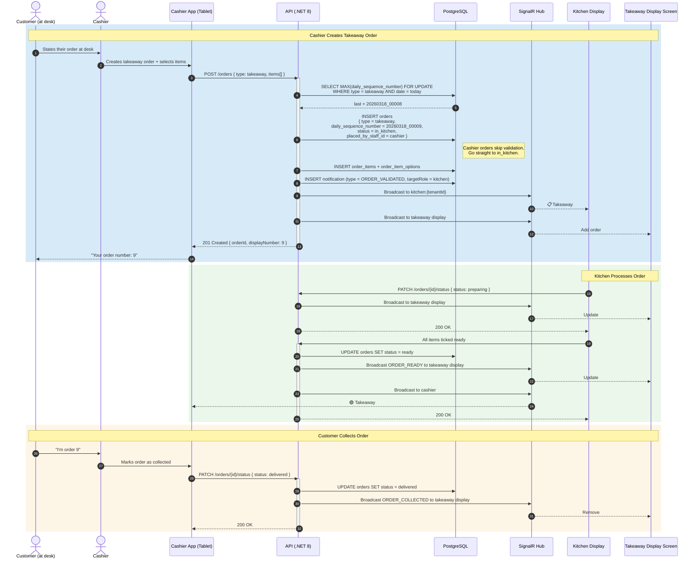

# Sequence — Takeaway Order Flow

```mermaid
sequenceDiagram
    autonumber
    actor CUS      as Customer (at desk)
    actor CSH      as Cashier
    participant CASHAPP as Cashier App (Tablet)
    participant API     as API (.NET 8)
    participant DB      as PostgreSQL
    participant HUB     as SignalR Hub
    participant KIT     as Kitchen Display
    participant TV      as Takeaway Display Screen

    rect rgb(214, 234, 248)
        Note over CUS,TV: Cashier Creates Takeaway Order
        CUS->>CSH: States their order at desk
        CSH->>CASHAPP: Creates takeaway order + selects items
        CASHAPP->>API: POST /orders { type: takeaway, items[] }
        activate API
        API->>DB: SELECT MAX(daily_sequence_number) FOR UPDATE<br/>WHERE type = takeaway AND date = today
        DB-->>API: last = 20260318_00008
        API->>DB: INSERT orders<br/>{ type = takeaway,<br/>daily_sequence_number = 20260318_00009,<br/>status = in_kitchen,<br/>placed_by_staff_id = cashier }
        Note right of DB: Cashier orders skip validation.<br/>Go straight to in_kitchen.
        API->>DB: INSERT order_items + order_item_options
        API->>DB: INSERT notification (type = ORDER_VALIDATED, targetRole = kitchen)
        API->>HUB: Broadcast to kitchen:{tenantId}
        HUB-->>KIT: 📋 Takeaway #9 — 2 items
        API->>HUB: Broadcast to takeaway display
        HUB-->>TV: Add order #9 → Submitted
        API-->>CASHAPP: 201 Created { orderId, displayNumber: 9 }
        deactivate API
        CASHAPP-->>CUS: "Your order number: 9"
    end

    rect rgb(234, 247, 234)
        Note over KIT,TV: Kitchen Processes Order
        KIT->>API: PATCH /orders/{id}/status { status: preparing }
        API->>HUB: Broadcast to takeaway display
        HUB-->>TV: Update #9 → Preparing
        API-->>KIT: 200 OK

        KIT->>API: All items ticked ready
        activate API
        API->>DB: UPDATE orders SET status = ready
        API->>HUB: Broadcast ORDER_READY to takeaway display
        HUB-->>TV: Update #9 → ✅ Ready — Please collect!
        API->>HUB: Broadcast to cashier
        HUB-->>CASHAPP: 🟢 Takeaway #9 is ready
        API-->>KIT: 200 OK
        deactivate API
    end

    rect rgb(253, 245, 230)
        Note over CUS,TV: Customer Collects Order
        CUS->>CSH: "I'm order 9"
        CSH->>CASHAPP: Marks order as collected
        CASHAPP->>API: PATCH /orders/{id}/status { status: delivered }
        activate API
        API->>DB: UPDATE orders SET status = delivered
        API->>HUB: Broadcast ORDER_COLLECTED to takeaway display
        HUB-->>TV: Remove #9 from display
        API-->>CASHAPP: 200 OK
        deactivate API
    end
```
