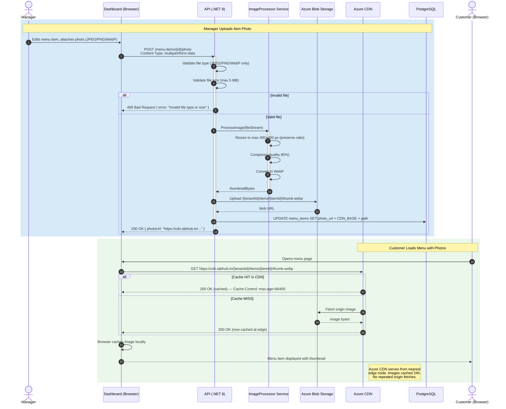

# Sequence — Image Upload & CDN Delivery

```mermaid
sequenceDiagram
    autonumber
    actor MGR  as Manager
    participant DASH as Dashboard (Browser)
    participant API  as API (.NET 8)
    participant IMG  as ImageProcessor Service
    participant BLOB as Azure Blob Storage
    participant CDN  as Azure CDN
    participant DB   as PostgreSQL
    actor CUS  as Customer (Browser)

    rect rgb(214, 234, 248)
        Note over MGR,DB: Manager Uploads Item Photo
        MGR->>DASH: Edits menu item, attaches photo (JPEG/PNG/WebP)
        DASH->>API: POST /menu-items/{id}/photo<br/>Content-Type: multipart/form-data
        activate API
        API->>API: Validate file type (JPEG/PNG/WebP only)
        API->>API: Validate file size (max 5 MB)
        alt Invalid file
            API-->>DASH: 400 Bad Request { error: "Invalid file type or size" }
        else Valid file
            API->>IMG: ProcessImage(fileStream)
            activate IMG
            IMG->>IMG: Resize to max 400×400 px (preserve ratio)
            IMG->>IMG: Compress (quality 85%)
            IMG->>IMG: Convert to WebP
            IMG-->>API: thumbnailBytes
            deactivate IMG
            API->>BLOB: Upload /{tenantId}/items/{itemId}/thumb.webp
            BLOB-->>API: blob URL
            API->>DB: UPDATE menu_items SET photo_url = CDN_BASE + path
            API-->>DASH: 200 OK { photoUrl: "https://cdn.tabhub.tn/..." }
        end
        deactivate API
    end

    rect rgb(234, 247, 234)
        Note over CUS,CDN: Customer Loads Menu with Photos
        CUS->>DASH: Opens menu page
        DASH->>CDN: GET https://cdn.tabhub.tn/{tenantId}/items/{itemId}/thumb.webp
        alt Cache HIT in CDN
            CDN-->>DASH: 200 OK (cached) — Cache-Control: max-age=86400
        else Cache MISS
            CDN->>BLOB: Fetch origin image
            BLOB-->>CDN: image bytes
            CDN-->>DASH: 200 OK (now cached at edge)
        end
        DASH->>DASH: Browser caches image locally
        DASH-->>CUS: Menu item displayed with thumbnail
        Note right of CDN: Azure CDN serves from nearest<br/>edge node. Images cached 24h.<br/>No repeated origin fetches.
    end
```
