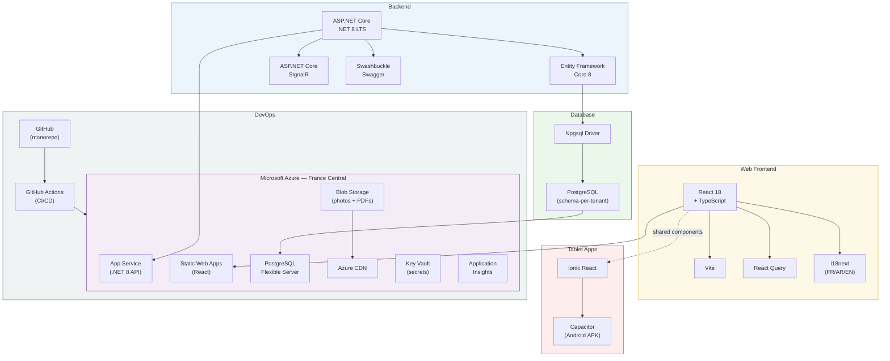

# Sprint 0 — Technology Stack Overview

```mermaid
flowchart TD
    subgraph BACKEND["Backend"]
        NET["ASP.NET Core\n.NET 8 LTS"]
        EF["Entity Framework\nCore 8"]
        SIG["ASP.NET Core\nSignalR"]
        SW["Swashbuckle\nSwagger"]
        NET --> EF & SIG & SW
    end

    subgraph DB["Database"]
        PG["PostgreSQL\n(schema-per-tenant)"]
        NP["Npgsql Driver"]
        EF --> NP --> PG
    end

    subgraph FRONTEND["Web Frontend"]
        RCT["React 18\n+ TypeScript"]
        VITE["Vite"]
        RQ["React Query"]
        I18["i18next\n(FR/AR/EN)"]
        RCT --> VITE & RQ & I18
    end

    subgraph MOBILE["Tablet Apps"]
        ION["Ionic React"]
        CAP["Capacitor\n(Android APK)"]
        ION --> CAP
        RCT -.->|"shared components"| ION
    end

    subgraph CLOUD["Microsoft Azure — France Central"]
        AS["App Service\n(.NET 8 API)"]
        SWA["Static Web Apps\n(React)"]
        PGAZ["PostgreSQL\nFlexible Server"]
        BLOB["Blob Storage\n(photos + PDFs)"]
        CDN["Azure CDN"]
        KV["Key Vault\n(secrets)"]
        AI["Application\nInsights"]
    end

    subgraph DEVOPS["DevOps"]
        GH["GitHub\n(monorepo)"]
        GHA["GitHub Actions\n(CI/CD)"]
        GH --> GHA --> CLOUD
    end

    NET --> AS
    RCT --> SWA
    PG --> PGAZ
    BLOB --> CDN

    style BACKEND fill:#EBF5FB,stroke:#2E86C1
    style DB fill:#EAF7EA,stroke:#1E8449
    style FRONTEND fill:#FEF9E7,stroke:#D4AC0D
    style MOBILE fill:#FDEDEC,stroke:#CB4335
    style CLOUD fill:#F4ECF7,stroke:#7D3C98
    style DEVOPS fill:#F0F3F4,stroke:#717D7E
```
