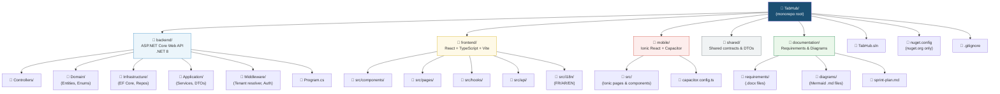

# Sprint 0 — Monorepo Structure

```mermaid
flowchart TD
    ROOT["📁 TabHub/\n(monorepo root)"]

    ROOT --> BE["📁 backend/\nASP.NET Core Web API\n.NET 8"]
    ROOT --> FE["📁 frontend/\nReact + TypeScript + Vite"]
    ROOT --> MOB["📁 mobile/\nIonic React + Capacitor"]
    ROOT --> SH["📁 shared/\nShared contracts & DTOs"]
    ROOT --> DOC["📁 documentation/\nRequirements & Diagrams"]
    ROOT --> SLN["📄 TabHub.sln"]
    ROOT --> NUGET["📄 nuget.config\n(nuget.org only)"]
    ROOT --> GIT["📄 .gitignore"]

    BE --> BE1["📁 Controllers/"]
    BE --> BE2["📁 Domain/\n(Entities, Enums)"]
    BE --> BE3["📁 Infrastructure/\n(EF Core, Repos)"]
    BE --> BE4["📁 Application/\n(Services, DTOs)"]
    BE --> BE5["📁 Middleware/\n(Tenant resolver, Auth)"]
    BE --> BE6["📄 Program.cs"]

    FE --> FE1["📁 src/components/"]
    FE --> FE2["📁 src/pages/"]
    FE --> FE3["📁 src/hooks/"]
    FE --> FE4["📁 src/api/"]
    FE --> FE5["📁 src/i18n/\n(FR/AR/EN)"]

    MOB --> MOB1["📁 src/\n(Ionic pages & components)"]
    MOB --> MOB2["📄 capacitor.config.ts"]

    DOC --> DOC1["📁 requirements/\n(.docx files)"]
    DOC --> DOC2["📁 diagrams/\n(Mermaid .md files)"]
    DOC --> DOC3["📄 sprint-plan.md"]

    style ROOT fill:#1B4F72,color:#fff
    style BE fill:#EBF5FB,stroke:#2E86C1
    style FE fill:#FEF9E7,stroke:#D4AC0D
    style MOB fill:#FDEDEC,stroke:#CB4335
    style SH fill:#F0F3F4,stroke:#717D7E
    style DOC fill:#EAF7EA,stroke:#1E8449
```
