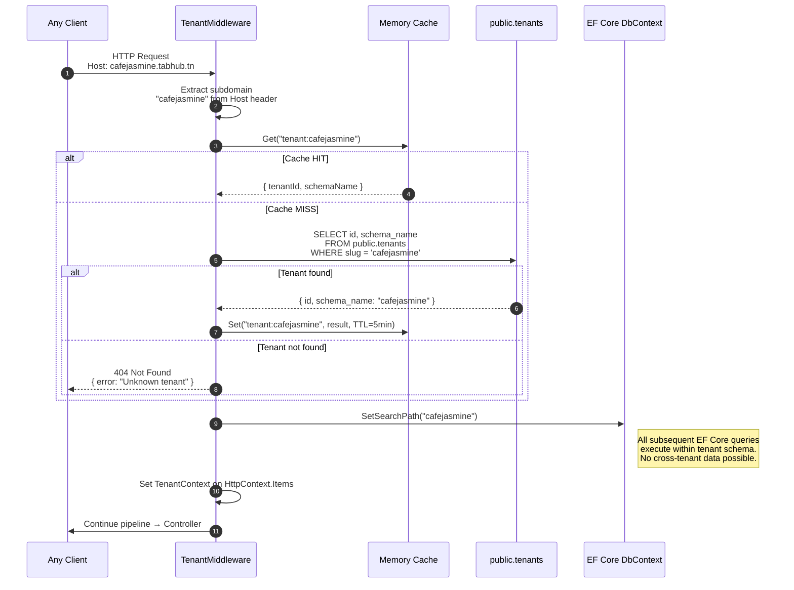

# Sprint 0 — Tenant Resolution Middleware

```mermaid
sequenceDiagram
    autonumber
    participant CLIENT as Any Client
    participant MW as TenantMiddleware
    participant CACHE as Memory Cache
    participant DB as public.tenants
    participant CTX as EF Core DbContext

    CLIENT->>MW: HTTP Request<br/>Host: cafejasmine.tabhub.tn

    MW->>MW: Extract subdomain<br/>"cafejasmine" from Host header

    MW->>CACHE: Get("tenant:cafejasmine")
    alt Cache HIT
        CACHE-->>MW: { tenantId, schemaName }
    else Cache MISS
        MW->>DB: SELECT id, schema_name<br/>FROM public.tenants<br/>WHERE slug = 'cafejasmine'
        alt Tenant found
            DB-->>MW: { id, schema_name: "cafejasmine" }
            MW->>CACHE: Set("tenant:cafejasmine", result, TTL=5min)
        else Tenant not found
            MW-->>CLIENT: 404 Not Found<br/>{ error: "Unknown tenant" }
        end
    end

    MW->>CTX: SetSearchPath("cafejasmine")
    Note right of CTX: All subsequent EF Core queries<br/>execute within tenant schema.<br/>No cross-tenant data possible.

    MW->>MW: Set TenantContext on HttpContext.Items
    MW->>CLIENT: Continue pipeline → Controller
```
