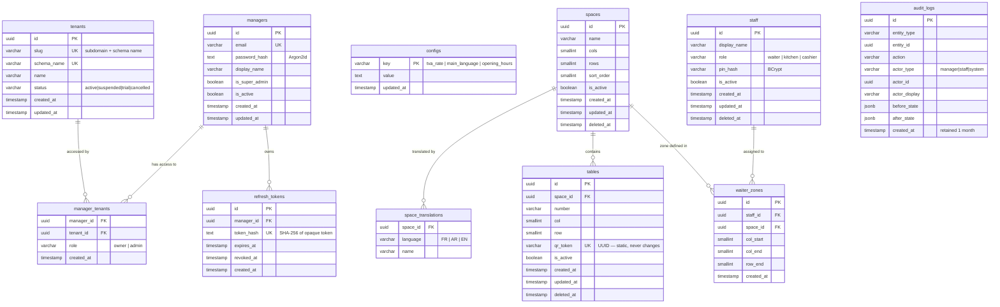

# Sprint 1 — ERD: Platform & Setup Schemas

```mermaid
erDiagram
    %% ── Public Schema ──────────────────────────────────────────────
    tenants {
        uuid    id          PK
        varchar slug        UK  "subdomain + schema name"
        varchar schema_name UK
        varchar name
        varchar status      "active|suspended|trial|cancelled"
        timestamp created_at
        timestamp updated_at
    }
    managers {
        uuid    id              PK
        varchar email           UK
        text    password_hash   "Argon2id"
        varchar display_name
        boolean is_super_admin
        boolean is_active
        timestamp created_at
        timestamp updated_at
    }
    manager_tenants {
        uuid    manager_id  FK
        uuid    tenant_id   FK
        varchar role        "owner | admin"
        timestamp created_at
    }
    refresh_tokens {
        uuid    id          PK
        uuid    manager_id  FK
        text    token_hash  UK  "SHA-256 of opaque token"
        timestamp expires_at
        timestamp revoked_at
        timestamp created_at
    }

    %% ── Tenant Schema (per restaurant) ────────────────────────────
    configs {
        varchar key         PK  "tva_rate | main_language | opening_hours"
        text    value
        timestamp updated_at
    }
    spaces {
        uuid     id          PK
        varchar  name
        smallint cols
        smallint rows
        smallint sort_order
        boolean  is_active
        timestamp created_at
        timestamp updated_at
        timestamp deleted_at
    }
    space_translations {
        uuid    space_id    FK
        varchar language    "FR | AR | EN"
        varchar name
    }
    tables {
        uuid     id          PK
        uuid     space_id    FK
        varchar  number
        smallint col
        smallint row
        varchar  qr_token    UK  "UUID — static, never changes"
        boolean  is_active
        timestamp created_at
        timestamp updated_at
        timestamp deleted_at
    }
    staff {
        uuid    id          PK
        varchar display_name
        varchar role        "waiter | kitchen | cashier"
        varchar pin_hash    "BCrypt"
        boolean is_active
        timestamp created_at
        timestamp updated_at
        timestamp deleted_at
    }
    waiter_zones {
        uuid     id          PK
        uuid     staff_id    FK
        uuid     space_id    FK
        smallint col_start
        smallint col_end
        smallint row_end
        timestamp created_at
    }
    audit_logs {
        uuid    id          PK
        varchar entity_type
        uuid    entity_id
        varchar action
        varchar actor_type  "manager|staff|system"
        uuid    actor_id
        varchar actor_display
        jsonb   before_state
        jsonb   after_state
        timestamp created_at  "retained 1 month"
    }

    managers        ||--o{ manager_tenants   : "has access to"
    tenants         ||--o{ manager_tenants   : "accessed by"
    managers        ||--o{ refresh_tokens    : "owns"
    spaces          ||--o{ space_translations : "translated by"
    spaces          ||--o{ tables            : "contains"
    spaces          ||--o{ waiter_zones      : "zone defined in"
    staff           ||--o{ waiter_zones      : "assigned to"
```
