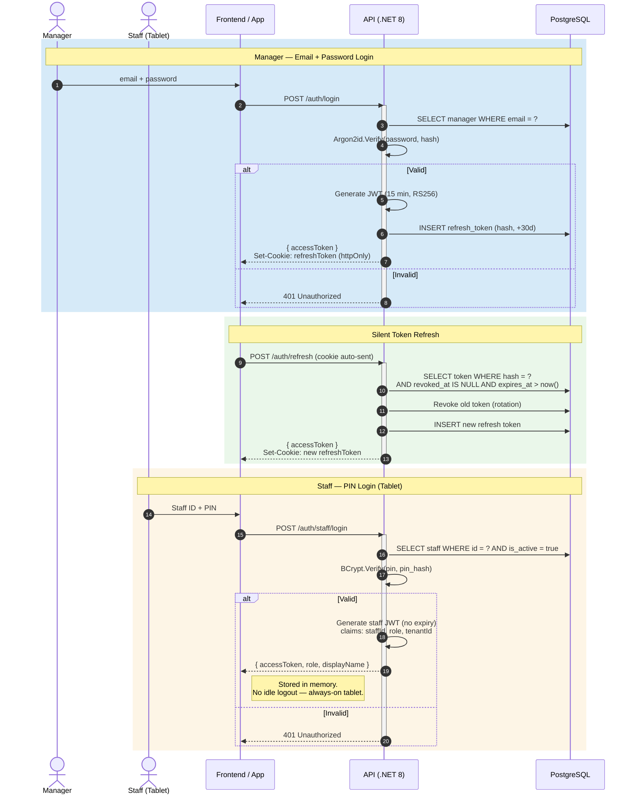

# Sprint 1 — Authentication Flows

```mermaid
sequenceDiagram
    autonumber
    actor MGR as Manager
    actor STF as Staff (Tablet)
    participant APP as Frontend / App
    participant API as API (.NET 8)
    participant DB  as PostgreSQL

    rect rgb(214, 234, 248)
        Note over MGR,DB: Manager — Email + Password Login
        MGR->>APP: email + password
        APP->>API: POST /auth/login
        activate API
        API->>DB: SELECT manager WHERE email = ?
        API->>API: Argon2id.Verify(password, hash)
        alt Valid
            API->>API: Generate JWT (15 min, RS256)
            API->>DB: INSERT refresh_token (hash, +30d)
            API-->>APP: { accessToken }<br/>Set-Cookie: refreshToken (httpOnly)
        else Invalid
            API-->>APP: 401 Unauthorized
        end
        deactivate API
    end

    rect rgb(234, 247, 234)
        Note over APP,DB: Silent Token Refresh
        APP->>API: POST /auth/refresh (cookie auto-sent)
        activate API
        API->>DB: SELECT token WHERE hash = ?<br/>AND revoked_at IS NULL AND expires_at > now()
        API->>DB: Revoke old token (rotation)
        API->>DB: INSERT new refresh token
        API-->>APP: { accessToken }<br/>Set-Cookie: new refreshToken
        deactivate API
    end

    rect rgb(253, 245, 230)
        Note over STF,DB: Staff — PIN Login (Tablet)
        STF->>APP: Staff ID + PIN
        APP->>API: POST /auth/staff/login
        activate API
        API->>DB: SELECT staff WHERE id = ? AND is_active = true
        API->>API: BCrypt.Verify(pin, pin_hash)
        alt Valid
            API->>API: Generate staff JWT (no expiry)<br/>claims: staffId, role, tenantId
            API-->>APP: { accessToken, role, displayName }
            Note right of APP: Stored in memory.<br/>No idle logout — always-on tablet.
        else Invalid
            API-->>APP: 401 Unauthorized
        end
        deactivate API
    end
```
