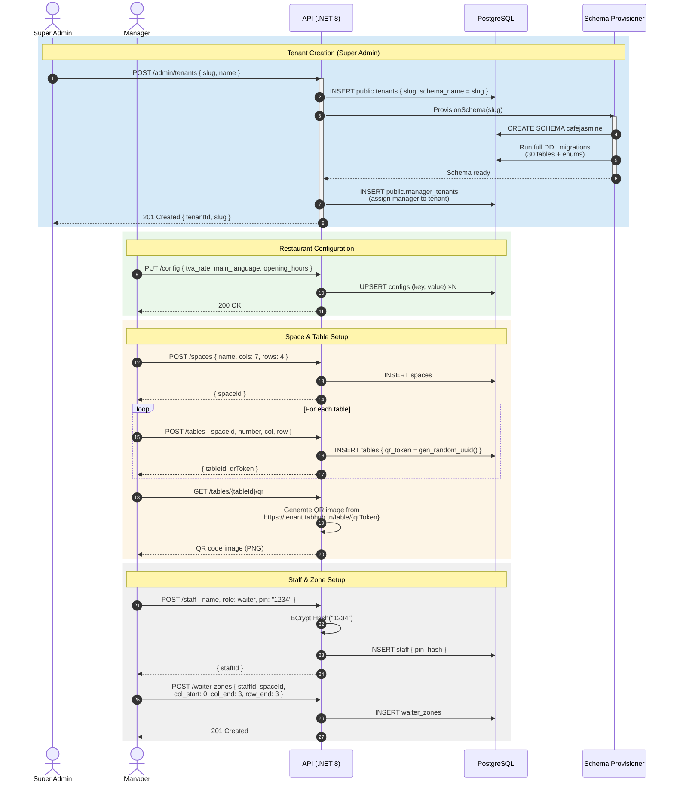

# Sprint 1 — Restaurant Setup Flow

```mermaid
sequenceDiagram
    autonumber
    actor SA  as Super Admin
    actor MGR as Manager
    participant API as API (.NET 8)
    participant DB  as PostgreSQL
    participant SCH as Schema Provisioner

    rect rgb(214, 234, 248)
        Note over SA,SCH: Tenant Creation (Super Admin)
        SA->>API: POST /admin/tenants { slug, name }
        activate API
        API->>DB: INSERT public.tenants { slug, schema_name = slug }
        API->>SCH: ProvisionSchema(slug)
        activate SCH
        SCH->>DB: CREATE SCHEMA cafejasmine
        SCH->>DB: Run full DDL migrations<br/>(30 tables + enums)
        SCH-->>API: Schema ready
        deactivate SCH
        API->>DB: INSERT public.manager_tenants<br/>(assign manager to tenant)
        API-->>SA: 201 Created { tenantId, slug }
        deactivate API
    end

    rect rgb(234, 247, 234)
        Note over MGR,DB: Restaurant Configuration
        MGR->>API: PUT /config { tva_rate, main_language, opening_hours }
        API->>DB: UPSERT configs (key, value) ×N
        API-->>MGR: 200 OK
    end

    rect rgb(253, 245, 230)
        Note over MGR,DB: Space & Table Setup
        MGR->>API: POST /spaces { name, cols: 7, rows: 4 }
        API->>DB: INSERT spaces
        API-->>MGR: { spaceId }

        loop For each table
            MGR->>API: POST /tables { spaceId, number, col, row }
            API->>DB: INSERT tables { qr_token = gen_random_uuid() }
            API-->>MGR: { tableId, qrToken }
        end

        MGR->>API: GET /tables/{tableId}/qr
        API->>API: Generate QR image from<br/>https://tenant.tabhub.tn/table/{qrToken}
        API-->>MGR: QR code image (PNG)
    end

    rect rgb(240, 240, 240)
        Note over MGR,DB: Staff & Zone Setup
        MGR->>API: POST /staff { name, role: waiter, pin: "1234" }
        API->>API: BCrypt.Hash("1234")
        API->>DB: INSERT staff { pin_hash }
        API-->>MGR: { staffId }

        MGR->>API: POST /waiter-zones { staffId, spaceId,<br/>col_start: 0, col_end: 3, row_end: 3 }
        API->>DB: INSERT waiter_zones
        API-->>MGR: 201 Created
    end
```
