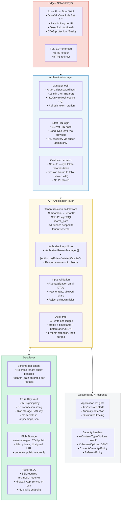

# Sprint 10 — Security Layers

```mermaid
flowchart TD
    subgraph EDGE["Edge / Network layer"]
        WAF["Azure Front Door WAF\n• OWASP Core Rule Set 3.2\n• Rate limiting per IP\n• Geo-block (optional)\n• DDoS protection (Basic)"]
        TLS["TLS 1.2+ enforced\nHSTS header\nHTTPS redirect"]
    end

    subgraph AUTH["Authentication layer"]
        MGR_AUTH["Manager login\n• Argon2id password hash\n• 15-min JWT (Bearer)\n• httpOnly refresh cookie (7d)\n• Refresh token rotation"]
        STAFF_AUTH["Staff PIN login\n• BCrypt PIN hash\n• Long-lived JWT (no browser)\n• PIN recovery via super-admin only"]
        CUST_AUTH["Customer session\n• No auth — QR token resolves table\n• Session bound to table (server side)\n• No PII stored"]
    end

    subgraph API_SEC["API / Application layer"]
        TENANT["Tenant isolation middleware\n• Subdomain → tenantId\n• Sets PostgreSQL search_path\n• All queries scoped to tenant schema"]
        AUTHZ["Authorization policies\n• [Authorize(Roles='Manager')]\n• [Authorize(Roles='Waiter|Cashier')]\n• Resource ownership checks"]
        VALIDATE["Input validation\n• FluentValidation on all DTOs\n• Max lengths, allowed chars\n• Reject unknown fields"]
        AUDIT["Audit trail\n• All write ops logged\n• staffId + timestamp + before/after JSON\n• 1 month retention, then purged"]
    end

    subgraph DATA["Data layer"]
        SCHEMA["Schema-per-tenant\n• No cross-tenant query possible\n• search_path enforced per request"]
        SECRETS["Azure Key Vault\n• JWT signing key\n• DB connection string\n• Blob storage SAS key\n• No secrets in appsettings.json"]
        BLOB_SEC["Blob Storage\n• menu-images: CDN public\n• bills: private, 1h signed URL\n• qr-codes: public read-only"]
        PGSSL["PostgreSQL\n• SSL required (sslmode=require)\n• Firewall: App Service IP only\n• No public endpoint"]
    end

    subgraph MONITOR["Observability / Response"]
        APPINS["Application Insights\n• 4xx/5xx rate alerts\n• Anomaly detection\n• Distributed tracing"]
        HEADERS["Security headers\n• X-Content-Type-Options: nosniff\n• X-Frame-Options: DENY\n• Content-Security-Policy\n• Referrer-Policy"]
    end

    EDGE --> AUTH
    AUTH --> API_SEC
    API_SEC --> DATA
    API_SEC --> MONITOR

    style EDGE fill:#FADBD8,stroke:#CB4335
    style AUTH fill:#EBF5FB,stroke:#2E86C1
    style API_SEC fill:#FEF9E7,stroke:#D4AC0D
    style DATA fill:#D5F5E3,stroke:#1E8449
    style MONITOR fill:#F4F6F7,stroke:#888
```
