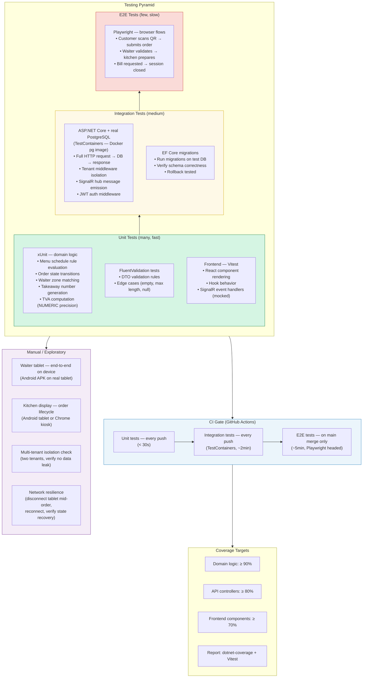

# Sprint 10 — Test Strategy & Coverage

```mermaid
flowchart TD
    subgraph PYRAMID["Testing Pyramid"]
        direction BT

        subgraph E2E["E2E Tests (few, slow)"]
            E2E1["Playwright — browser flows\n• Customer scans QR → submits order\n• Waiter validates → kitchen prepares\n• Bill requested → session closed"]
        end

        subgraph INTEGRATION["Integration Tests (medium)"]
            INT1["ASP.NET Core + real PostgreSQL\n(TestContainers — Docker pg image)\n• Full HTTP request → DB → response\n• Tenant middleware isolation\n• SignalR hub message emission\n• JWT auth middleware"]
            INT2["EF Core migrations\n• Run migrations on test DB\n• Verify schema correctness\n• Rollback tested"]
        end

        subgraph UNIT["Unit Tests (many, fast)"]
            U1["xUnit — domain logic\n• Menu schedule rule evaluation\n• Order state transitions\n• Waiter zone matching\n• Takeaway number generation\n• TVA computation (NUMERIC precision)"]
            U2["FluentValidation tests\n• DTO validation rules\n• Edge cases (empty, max length, null)"]
            U3["Frontend — Vitest\n• React component rendering\n• Hook behavior\n• SignalR event handlers (mocked)"]
        end

        UNIT --> INTEGRATION --> E2E
    end

    subgraph CI["CI Gate (GitHub Actions)"]
        CI1["Unit tests — every push\n(< 30s)"]
        CI2["Integration tests — every push\n(TestContainers, ~2min)"]
        CI3["E2E tests — on main merge only\n(~5min, Playwright headed)"]
        CI1 --> CI2 --> CI3
    end

    subgraph COVERAGE["Coverage Targets"]
        COV1["Domain logic: ≥ 90%"]
        COV2["API controllers: ≥ 80%"]
        COV3["Frontend components: ≥ 70%"]
        COV4["Report: dotnet-coverage + Vitest"]
    end

    subgraph MANUAL["Manual / Exploratory"]
        MAN1["Waiter tablet — end-to-end on device\n(Android APK on real tablet)"]
        MAN2["Kitchen display — order lifecycle\n(Android tablet or Chrome kiosk)"]
        MAN3["Multi-tenant isolation check\n(two tenants, verify no data leak)"]
        MAN4["Network resilience\n(disconnect tablet mid-order,\nreconnect, verify state recovery)"]
    end

    CI --> COVERAGE
    PYRAMID --> CI
    PYRAMID --> MANUAL

    style E2E fill:#FADBD8,stroke:#CB4335
    style INTEGRATION fill:#FEF9E7,stroke:#D4AC0D
    style UNIT fill:#D5F5E3,stroke:#1E8449
    style CI fill:#EBF5FB,stroke:#2E86C1
    style MANUAL fill:#F4ECF7,stroke:#7D3C98
```
