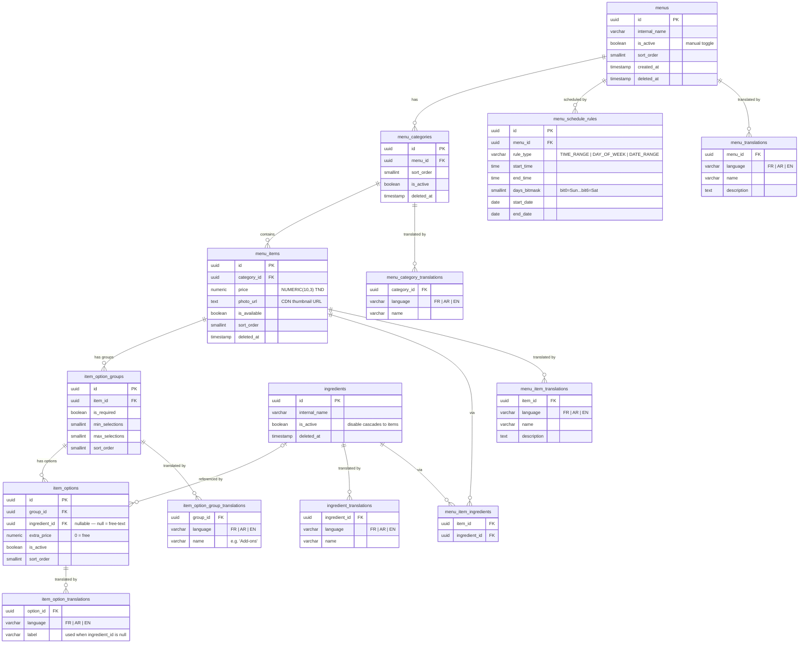

# Sprint 2 — ERD: Menu System

```mermaid
erDiagram
    menus {
        uuid     id              PK
        varchar  internal_name
        boolean  is_active       "manual toggle"
        smallint sort_order
        timestamp created_at
        timestamp deleted_at
    }
    menu_translations {
        uuid    menu_id     FK
        varchar language    "FR | AR | EN"
        varchar name
        text    description
    }
    menu_schedule_rules {
        uuid     id          PK
        uuid     menu_id     FK
        varchar  rule_type   "TIME_RANGE | DAY_OF_WEEK | DATE_RANGE"
        time     start_time
        time     end_time
        smallint days_bitmask  "bit0=Sun...bit6=Sat"
        date     start_date
        date     end_date
    }
    menu_categories {
        uuid     id          PK
        uuid     menu_id     FK
        smallint sort_order
        boolean  is_active
        timestamp deleted_at
    }
    menu_category_translations {
        uuid    category_id FK
        varchar language    "FR | AR | EN"
        varchar name
    }
    menu_items {
        uuid     id          PK
        uuid     category_id FK
        numeric  price       "NUMERIC(10,3) TND"
        text     photo_url   "CDN thumbnail URL"
        boolean  is_available
        smallint sort_order
        timestamp deleted_at
    }
    menu_item_translations {
        uuid    item_id     FK
        varchar language    "FR | AR | EN"
        varchar name
        text    description
    }
    ingredients {
        uuid    id              PK
        varchar internal_name
        boolean is_active       "disable cascades to items"
        timestamp deleted_at
    }
    ingredient_translations {
        uuid    ingredient_id   FK
        varchar language        "FR | AR | EN"
        varchar name
    }
    menu_item_ingredients {
        uuid item_id        FK
        uuid ingredient_id  FK
    }
    item_option_groups {
        uuid     id              PK
        uuid     item_id         FK
        boolean  is_required
        smallint min_selections
        smallint max_selections
        smallint sort_order
    }
    item_option_group_translations {
        uuid    group_id    FK
        varchar language    "FR | AR | EN"
        varchar name        "e.g. 'Add-ons'"
    }
    item_options {
        uuid     id             PK
        uuid     group_id       FK
        uuid     ingredient_id  FK  "nullable — null = free-text"
        numeric  extra_price    "0 = free"
        boolean  is_active
        smallint sort_order
    }
    item_option_translations {
        uuid    option_id   FK
        varchar language    "FR | AR | EN"
        varchar label       "used when ingredient_id is null"
    }

    menus                   ||--o{ menu_translations              : "translated by"
    menus                   ||--o{ menu_schedule_rules            : "scheduled by"
    menus                   ||--o{ menu_categories                : "has"
    menu_categories         ||--o{ menu_category_translations     : "translated by"
    menu_categories         ||--o{ menu_items                     : "contains"
    menu_items              ||--o{ menu_item_translations         : "translated by"
    menu_items              ||--o{ menu_item_ingredients          : "via"
    ingredients             ||--o{ menu_item_ingredients          : "via"
    ingredients             ||--o{ ingredient_translations        : "translated by"
    menu_items              ||--o{ item_option_groups             : "has groups"
    item_option_groups      ||--o{ item_option_group_translations : "translated by"
    item_option_groups      ||--o{ item_options                   : "has options"
    item_options            ||--o{ item_option_translations       : "translated by"
    ingredients             |o--o{ item_options                   : "referenced by"
```
