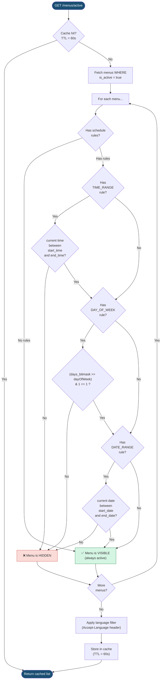

# Sprint 2 — Menu Schedule Evaluation Decision Tree

```mermaid
flowchart TD
    START(["GET /menus/active"]) --> CACHE{Cache hit?\nTTL = 60s}
    CACHE -->|Yes| RETURN(["Return cached list"])
    CACHE -->|No| FETCH["Fetch menus WHERE\nis_active = true"]

    FETCH --> LOOP["For each menu..."]

    LOOP --> HAS_RULES{Has schedule\nrules?}

    HAS_RULES -->|No rules| VISIBLE["✅ Menu is VISIBLE\n(always active)"]

    HAS_RULES -->|Has rules| TIME{Has\nTIME_RANGE\nrule?}

    TIME -->|Yes| TIME_CHECK{"current time\nbetween\nstart_time\nand end_time?"}
    TIME_CHECK -->|No| HIDDEN["❌ Menu is HIDDEN"]
    TIME_CHECK -->|Yes| DAY

    TIME -->|No| DAY{Has\nDAY_OF_WEEK\nrule?}

    DAY -->|Yes| DAY_CHECK{"(days_bitmask >> dayOfWeek)\n& 1 == 1 ?"}
    DAY_CHECK -->|No| HIDDEN
    DAY_CHECK -->|Yes| DATE

    DAY -->|No| DATE{Has\nDATE_RANGE\nrule?}

    DATE -->|Yes| DATE_CHECK{"current date\nbetween\nstart_date\nand end_date?"}
    DATE_CHECK -->|No| HIDDEN
    DATE_CHECK -->|Yes| VISIBLE

    DATE -->|No| VISIBLE

    VISIBLE --> MORE{More\nmenus?}
    HIDDEN --> MORE
    MORE -->|Yes| LOOP
    MORE -->|No| APPLY["Apply language filter\n(Accept-Language header)"]
    APPLY --> SAVE["Store in cache\n(TTL = 60s)"]
    SAVE --> RETURN

    style VISIBLE fill:#D5F5E3,stroke:#1E8449
    style HIDDEN fill:#FADBD8,stroke:#CB4335
    style START fill:#1B4F72,color:#fff
    style RETURN fill:#1B4F72,color:#fff
```
