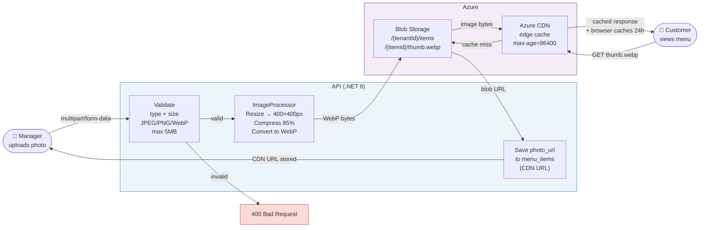

# Sprint 2 — Image Upload Pipeline

```mermaid
flowchart LR
    MGR(["👤 Manager\nuploads photo"])

    subgraph API["API (.NET 8)"]
        VAL["Validate\ntype + size\nJPEG/PNG/WebP\nmax 5MB"]
        PROC["ImageProcessor\nResize → 400×400px\nCompress 85%\nConvert to WebP"]
        SAVE["Save photo_url\nto menu_items\n(CDN URL)"]
    end

    subgraph AZURE["Azure"]
        BLOB["Blob Storage\n/{tenantId}/items\n/{itemId}/thumb.webp"]
        CDN["Azure CDN\nedge cache\nmax-age=86400"]
    end

    CUS(["👤 Customer\nviews menu"])

    MGR -->|"multipart/form-data"| VAL
    VAL -->|"valid"| PROC
    VAL -->|"invalid"| ERR["400 Bad Request"]
    PROC -->|"WebP bytes"| BLOB
    BLOB -->|"blob URL"| SAVE
    SAVE -->|"CDN URL stored"| MGR

    CUS -->|"GET thumb.webp"| CDN
    CDN -->|"cache miss"| BLOB
    BLOB -->|"image bytes"| CDN
    CDN -->|"cached response\n+ browser caches 24h"| CUS

    style API fill:#EBF5FB,stroke:#2E86C1
    style AZURE fill:#F4ECF7,stroke:#7D3C98
    style ERR fill:#FADBD8,stroke:#CB4335
```
