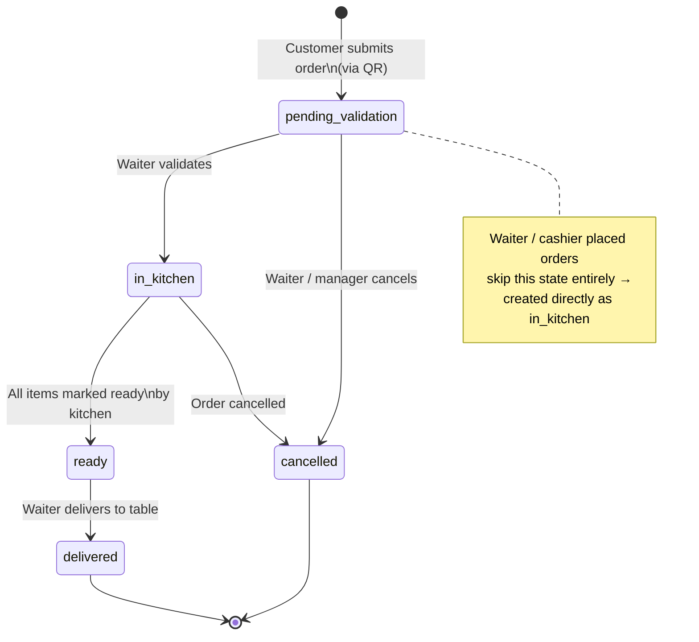
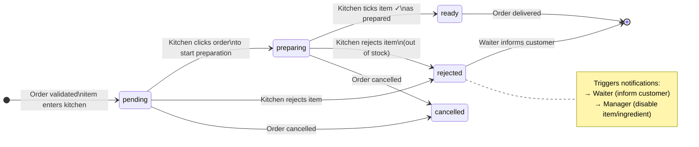

# Sprint 3 — Order & Item Status State Machines

```mermaid
stateDiagram-v2
    [*] --> pending_validation : Customer submits order\n(via QR)

    pending_validation --> in_kitchen : Waiter validates
    pending_validation --> cancelled : Waiter / manager cancels

    in_kitchen --> ready : All items marked ready\nby kitchen
    in_kitchen --> cancelled : Order cancelled

    ready --> delivered : Waiter delivers to table
    delivered --> [*]
    cancelled --> [*]

    note right of pending_validation
        Waiter / cashier placed orders
        skip this state entirely →
        created directly as in_kitchen
    end note
```

---

```mermaid
stateDiagram-v2
    direction LR
    [*] --> pending : Order validated\nitem enters kitchen

    pending --> preparing : Kitchen clicks order\nto start preparation

    preparing --> ready : Kitchen ticks item ✓\nas prepared

    ready --> [*] : Order delivered

    preparing --> rejected : Kitchen rejects item\n(out of stock)
    pending --> rejected : Kitchen rejects item

    rejected --> [*] : Waiter informs customer

    pending --> cancelled : Order cancelled
    preparing --> cancelled : Order cancelled

    note right of rejected
        Triggers notifications:
        → Waiter (inform customer)
        → Manager (disable item/ingredient)
    end note
```
