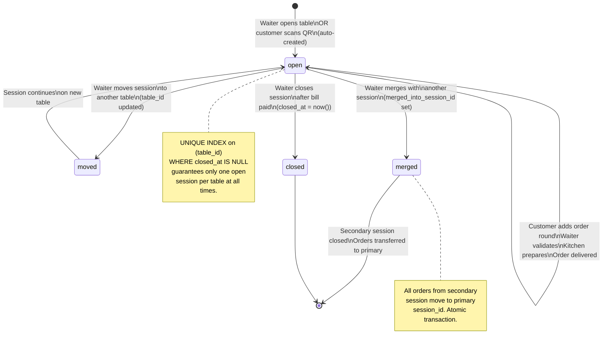

# Sprint 3 — Table Session Lifecycle

```mermaid
stateDiagram-v2
    [*] --> open : Waiter opens table\nOR customer scans QR\n(auto-created)

    open --> open : Customer adds order round\nWaiter validates\nKitchen prepares\nOrder delivered

    open --> moved : Waiter moves session\nto another table\n(table_id updated)
    moved --> open : Session continues\non new table

    open --> merged : Waiter merges with\nanother session\n(merged_into_session_id set)
    merged --> [*] : Secondary session closed\nOrders transferred to primary

    open --> closed : Waiter closes session\nafter bill paid\n(closed_at = now())
    closed --> [*]

    note right of open
        UNIQUE INDEX on (table_id)
        WHERE closed_at IS NULL
        guarantees only one open
        session per table at all times.
    end note

    note right of merged
        All orders from secondary
        session move to primary
        session_id. Atomic transaction.
    end note
```
