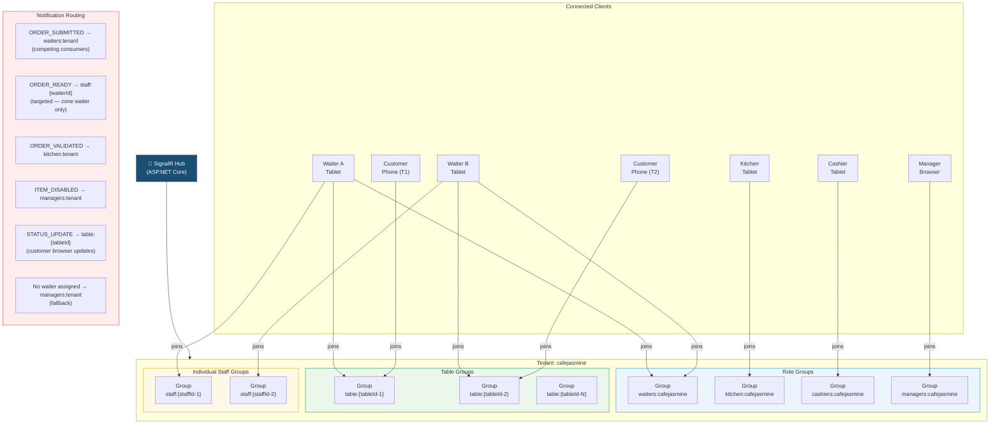

# Sprint 4 — SignalR Group Topology

```mermaid
flowchart TB
    HUB["🔌 SignalR Hub\n(ASP.NET Core)"]

    subgraph TENANT["Tenant: cafejasmine"]
        subgraph ROLES["Role Groups"]
            GW["Group\nwaiters:cafejasmine"]
            GK["Group\nkitchen:cafejasmine"]
            GC["Group\ncashiers:cafejasmine"]
            GM["Group\nmanagers:cafejasmine"]
        end

        subgraph TABLES["Table Groups"]
            GT1["Group\ntable:{tableId-1}"]
            GT2["Group\ntable:{tableId-2}"]
            GTN["Group\ntable:{tableId-N}"]
        end

        subgraph STAFF["Individual Staff Groups"]
            GS1["Group\nstaff:{staffId-1}"]
            GS2["Group\nstaff:{staffId-2}"]
        end
    end

    subgraph CLIENTS["Connected Clients"]
        WA["Waiter A\nTablet"]
        WB["Waiter B\nTablet"]
        KIT["Kitchen\nTablet"]
        CSH["Cashier\nTablet"]
        MGR["Manager\nBrowser"]
        CUS1["Customer\nPhone (T1)"]
        CUS2["Customer\nPhone (T2)"]
    end

    HUB --> TENANT

    WA -->|"joins"| GW & GS1 & GT1
    WB -->|"joins"| GW & GS2 & GT2
    KIT -->|"joins"| GK
    CSH -->|"joins"| GC
    MGR -->|"joins"| GM
    CUS1 -->|"joins"| GT1
    CUS2 -->|"joins"| GT2

    subgraph EVENTS["Notification Routing"]
        E1["ORDER_SUBMITTED → waiters:tenant\n(competing consumers)"]
        E2["ORDER_READY → staff:{waiterId}\n(targeted — zone waiter only)"]
        E3["ORDER_VALIDATED → kitchen:tenant"]
        E4["ITEM_DISABLED → managers:tenant"]
        E5["STATUS_UPDATE → table:{tableId}\n(customer browser updates)"]
        E6["No waiter assigned → managers:tenant\n(fallback)"]
    end

    style HUB fill:#1B4F72,color:#fff
    style ROLES fill:#EBF5FB,stroke:#2E86C1
    style TABLES fill:#EAF7EA,stroke:#1E8449
    style STAFF fill:#FEF9E7,stroke:#D4AC0D
    style EVENTS fill:#FDEDEC,stroke:#CB4335
```
