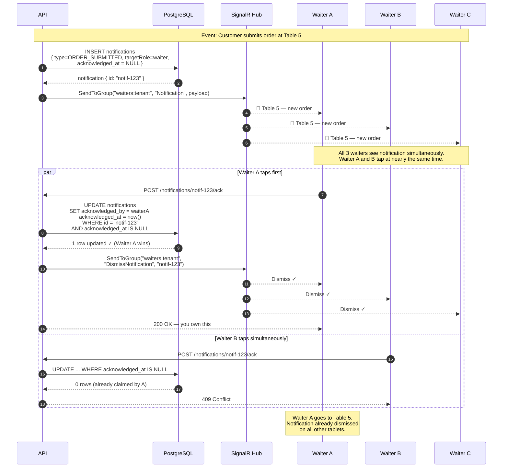

# Sprint 4 — Competing Consumer ACK Pattern

```mermaid
sequenceDiagram
    autonumber
    participant API  as API
    participant DB   as PostgreSQL
    participant HUB  as SignalR Hub
    participant WA   as Waiter A
    participant WB   as Waiter B
    participant WC   as Waiter C

    Note over API,WC: Event: Customer submits order at Table 5

    API->>DB: INSERT notifications<br/>{ type=ORDER_SUBMITTED, targetRole=waiter,<br/>acknowledged_at = NULL }
    DB-->>API: notification { id: "notif-123" }

    API->>HUB: SendToGroup("waiters:tenant", "Notification", payload)
    HUB-->>WA: 🔔 Table 5 — new order
    HUB-->>WB: 🔔 Table 5 — new order
    HUB-->>WC: 🔔 Table 5 — new order

    Note over WA,WC: All 3 waiters see notification simultaneously.<br/>Waiter A and B tap at nearly the same time.

    par Waiter A taps first
        WA->>API: POST /notifications/notif-123/ack
        API->>DB: UPDATE notifications<br/>SET acknowledged_by = waiterA,<br/>acknowledged_at = now()<br/>WHERE id = 'notif-123'<br/>AND acknowledged_at IS NULL
        DB-->>API: 1 row updated ✓ (Waiter A wins)
        API->>HUB: SendToGroup("waiters:tenant",<br/>"DismissNotification", "notif-123")
        HUB-->>WA: Dismiss ✓
        HUB-->>WB: Dismiss ✓
        HUB-->>WC: Dismiss ✓
        API-->>WA: 200 OK — you own this
    and Waiter B taps simultaneously
        WB->>API: POST /notifications/notif-123/ack
        API->>DB: UPDATE ... WHERE acknowledged_at IS NULL
        DB-->>API: 0 rows (already claimed by A)
        API-->>WB: 409 Conflict
    end

    Note over WA: Waiter A goes to Table 5.<br/>Notification already dismissed<br/>on all other tablets.
```
