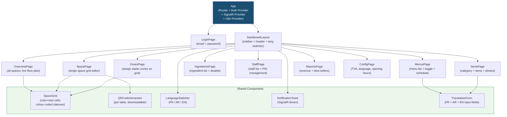

# Sprint 5 — Manager Dashboard Component Tree

```mermaid
flowchart TD
    APP["App\n(Router + Auth Provider\n+ SignalR Provider\n+ i18n Provider)"]

    APP --> LOGIN["LoginPage\n(email + password)"]
    APP --> LAYOUT["DashboardLayout\n(sidebar + header + lang switcher)"]

    LAYOUT --> OVERVIEW["OverviewPage\n(all spaces, live floor plan)"]
    LAYOUT --> SPACE["SpacePage\n(single space grid editor)"]
    LAYOUT --> MENUS["MenusPage\n(menu list + toggle + schedule)"]
    LAYOUT --> ITEMS["ItemsPage\n(category + items + photos)"]
    LAYOUT --> INGR["IngredientsPage\n(ingredient list + disable)"]
    LAYOUT --> STAFF["StaffPage\n(staff list + PIN management)"]
    LAYOUT --> ZONES["ZonesPage\n(assign waiter zones on grid)"]
    LAYOUT --> REPORTS["ReportsPage\n(revenue + best sellers)"]
    LAYOUT --> CONFIG["ConfigPage\n(TVA, language, opening hours)"]

    subgraph SHARED["Shared Components"]
        GRID["SpaceGrid\n(cols×rows cells,\ncolour-coded statuses)"]
        QRGEN["QRCodeGenerator\n(per table, downloadable)"]
        LANGSW["LanguageSwitcher\n(FR / AR / EN)"]
        NOTIFY["NotificationToast\n(SignalR-driven)"]
        TRANSF["TranslationForm\n(FR + AR + EN input fields)"]
    end

    OVERVIEW --> GRID
    SPACE --> GRID
    ZONES --> GRID
    SPACE --> QRGEN
    MENUS --> TRANSF
    ITEMS --> TRANSF
    LAYOUT --> LANGSW
    LAYOUT --> NOTIFY

    style APP fill:#1B4F72,color:#fff
    style SHARED fill:#EAF7EA,stroke:#1E8449
```
