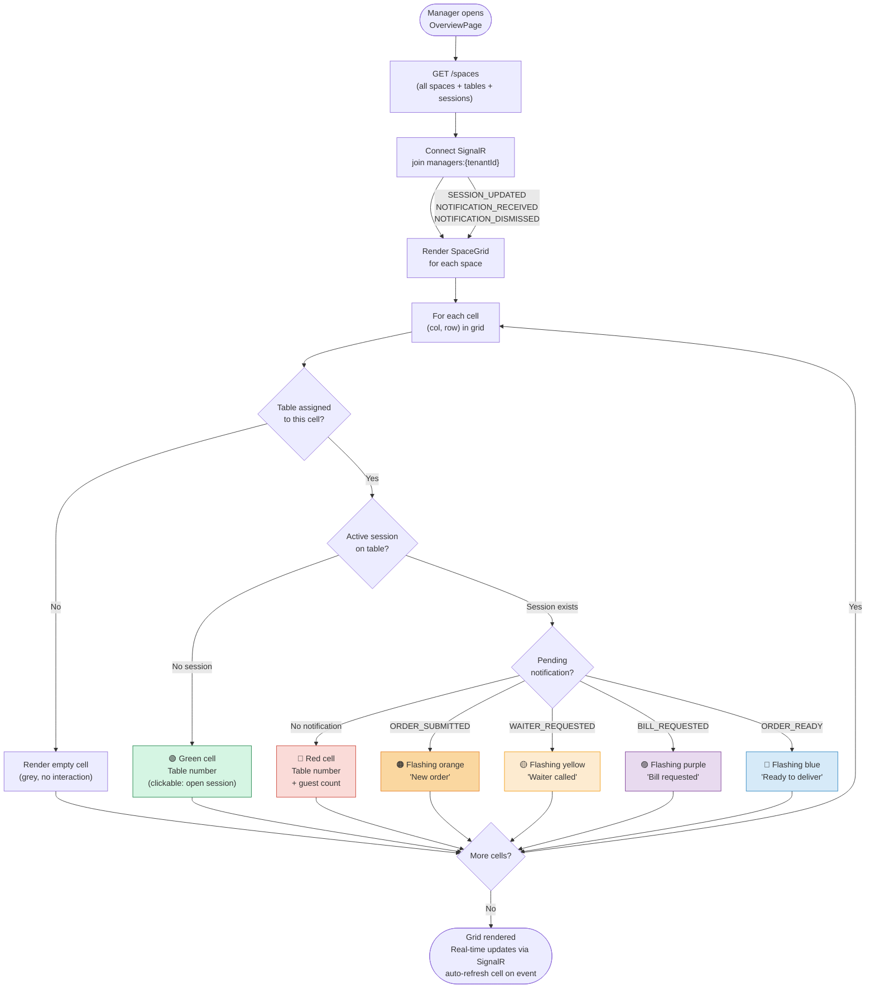

# Sprint 5 — Floor Plan Grid Rendering Logic

```mermaid
flowchart TD
    LOAD(["Manager opens\nOverviewPage"]) --> FETCH["GET /spaces\n(all spaces + tables + sessions)"]
    FETCH --> SIGNALR["Connect SignalR\njoin managers:{tenantId}"]

    SIGNALR --> RENDER["Render SpaceGrid\nfor each space"]

    RENDER --> LOOP["For each cell\n(col, row) in grid"]

    LOOP --> HAS_TABLE{Table assigned\nto this cell?}

    HAS_TABLE -->|No| EMPTY["Render empty cell\n(grey, no interaction)"]
    HAS_TABLE -->|Yes| SESSION{Active session\non table?}

    SESSION -->|No session| FREE["🟢 Green cell\nTable number\n(clickable: open session)"]
    SESSION -->|Session exists| CHECK_NOTIF{Pending\nnotification?}

    CHECK_NOTIF -->|No notification| OCCUPIED["🔴 Red cell\nTable number\n+ guest count"]

    CHECK_NOTIF -->|ORDER_SUBMITTED| FLASH_ORANGE["🟠 Flashing orange\n'New order'"]
    CHECK_NOTIF -->|WAITER_REQUESTED| FLASH_YELLOW["🟡 Flashing yellow\n'Waiter called'"]
    CHECK_NOTIF -->|BILL_REQUESTED| FLASH_PURPLE["🟣 Flashing purple\n'Bill requested'"]
    CHECK_NOTIF -->|ORDER_READY| FLASH_BLUE["🔵 Flashing blue\n'Ready to deliver'"]

    EMPTY --> NEXT
    FREE --> NEXT
    OCCUPIED --> NEXT
    FLASH_ORANGE --> NEXT
    FLASH_YELLOW --> NEXT
    FLASH_PURPLE --> NEXT
    FLASH_BLUE --> NEXT

    NEXT{More cells?} -->|Yes| LOOP
    NEXT -->|No| DISPLAY(["Grid rendered\nReal-time updates via SignalR\nauto-refresh cell on event"])

    SIGNALR -->|"SESSION_UPDATED\nNOTIFICATION_RECEIVED\nNOTIFICATION_DISMISSED"| RENDER

    style FREE fill:#D5F5E3,stroke:#1E8449
    style OCCUPIED fill:#FADBD8,stroke:#CB4335
    style FLASH_ORANGE fill:#FAD7A0,stroke:#E67E22
    style FLASH_YELLOW fill:#FDEBD0,stroke:#F39C12
    style FLASH_PURPLE fill:#E8DAEF,stroke:#7D3C98
    style FLASH_BLUE fill:#D6EAF8,stroke:#2E86C1
```
