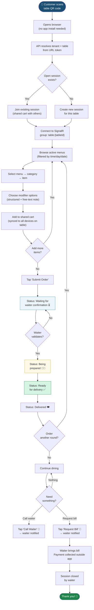

# Sprint 6 — Customer Journey Flowchart

```mermaid
flowchart TD
    START(["📱 Customer scans\ntable QR code"]) --> WIFI["Opens browser\n(no app install needed)"]
    WIFI --> RESOLVE["API resolves tenant + table\nfrom URL token"]

    RESOLVE --> SESSION{Open session\nexists?}
    SESSION -->|Yes| JOIN["Join existing session\n(shared cart with others)"]
    SESSION -->|No| CREATE["Create new session\nfor this table"]
    JOIN & CREATE --> CONNECT["Connect to SignalR\ngroup: table:{tableId}"]

    CONNECT --> MENUS["Browse active menus\n(filtered by time/day/date)"]
    MENUS --> SELECT["Select menu → category → item"]
    SELECT --> OPTIONS["Choose modifier options\n(structured + free-text note)"]
    OPTIONS --> CART["Add to shared cart\n(synced to all devices on table)"]
    CART --> MORE{Add more\nitems?}
    MORE -->|Yes| MENUS
    MORE -->|No| SUBMIT["Tap 'Submit Order'"]

    SUBMIT --> PENDING["Status: Waiting for\nwaiter confirmation ⏳"]
    PENDING --> VALIDATED{Waiter\nvalidates?}
    VALIDATED -->|Yes| KITCHEN["Status: Being\nprepared 👨‍🍳"]
    VALIDATED -->|No| PENDING

    KITCHEN --> READY["Status: Ready\nfor delivery ✅"]
    READY --> DELIVERED["Status: Delivered 🍽️"]

    DELIVERED --> ANOTHER{Order\nanother round?}
    ANOTHER -->|Yes| MENUS
    ANOTHER -->|No| WAIT["Continue dining"]

    WAIT --> ACTIONS{Need\nsomething?}
    ACTIONS -->|Call waiter| CALL["Tap 'Call Waiter' 🔔\n→ waiter notified"]
    ACTIONS -->|Request bill| BILL["Tap 'Request Bill' 🧾\n→ waiter notified"]
    ACTIONS -->|Nothing| WAIT

    BILL --> PAY["Waiter brings bill\nPayment collected outside app"]
    PAY --> CLOSE["Session closed\nby waiter"]
    CLOSE --> END(["Thank you! 👋"])

    style START fill:#1B4F72,color:#fff
    style END fill:#1E8449,color:#fff
    style KITCHEN fill:#FEF9E7,stroke:#D4AC0D
    style READY fill:#D5F5E3,stroke:#1E8449
    style PENDING fill:#EBF5FB,stroke:#2E86C1
```
