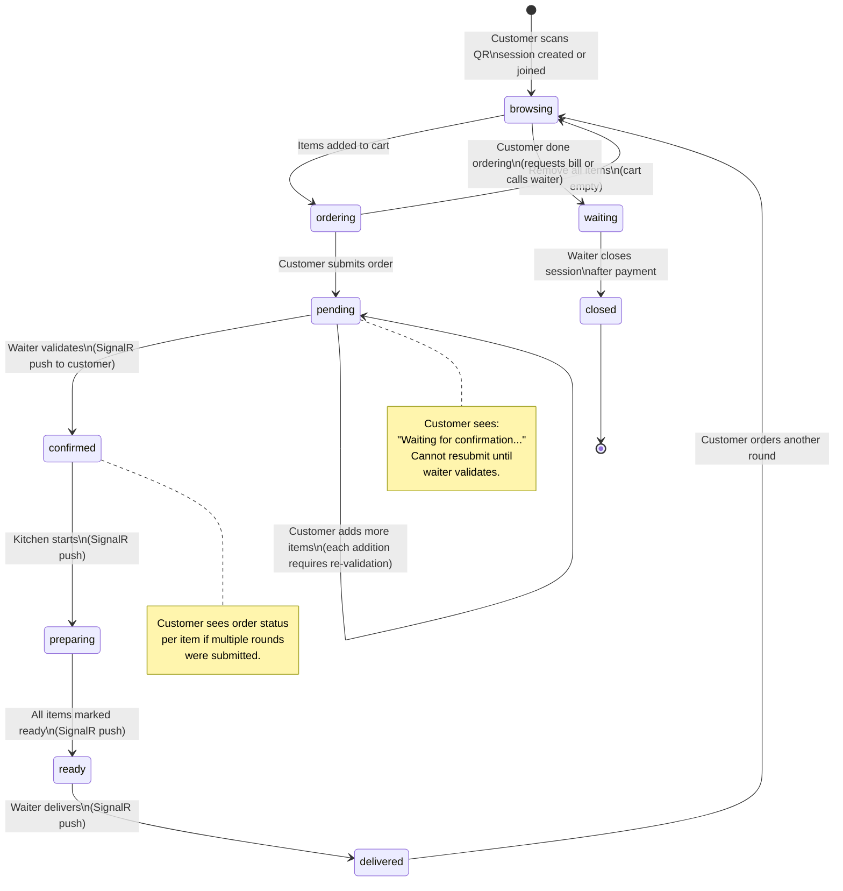

# Sprint 6 — Table Session State Machine (Customer Perspective)

```mermaid
stateDiagram-v2
    [*] --> browsing : Customer scans QR\nsession created or joined

    browsing --> ordering : Items added to cart

    ordering --> browsing : Remove all items\n(cart empty)

    ordering --> pending : Customer submits order

    pending --> confirmed : Waiter validates\n(SignalR push to customer)

    pending --> pending : Customer adds more items\n(each addition requires re-validation)

    confirmed --> preparing : Kitchen starts\n(SignalR push)

    preparing --> ready : All items marked ready\n(SignalR push)

    ready --> delivered : Waiter delivers\n(SignalR push)

    delivered --> browsing : Customer orders another round

    browsing --> waiting : Customer done ordering\n(requests bill or calls waiter)

    waiting --> closed : Waiter closes session\nafter payment

    closed --> [*]

    note right of pending
        Customer sees:
        "Waiting for confirmation..."
        Cannot resubmit until
        waiter validates.
    end note

    note right of confirmed
        Customer sees order status
        per item if multiple rounds
        were submitted.
    end note
```
