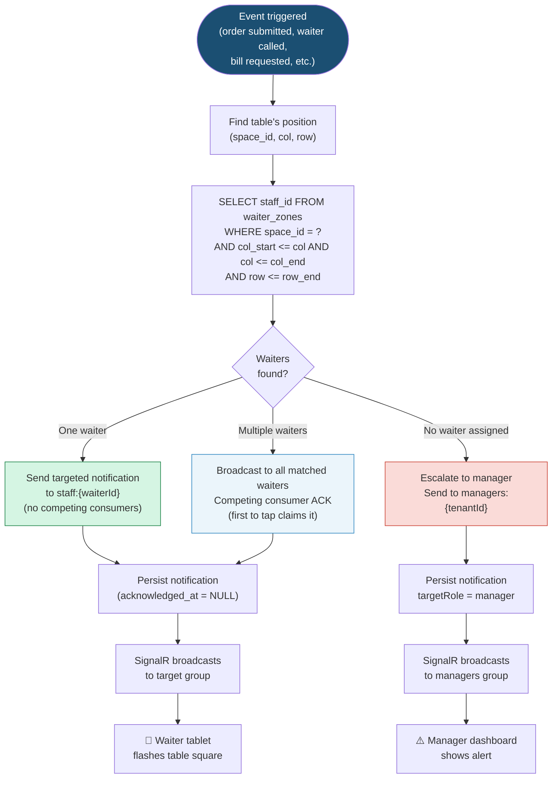

# Sprint 7 — Waiter Notification Routing Logic

```mermaid
flowchart TD
    EVENT(["Event triggered\n(order submitted, waiter called,\nbill requested, etc.)"])

    EVENT --> FIND["Find table's position\n(space_id, col, row)"]

    FIND --> QUERY["SELECT staff_id FROM waiter_zones\nWHERE space_id = ?\nAND col_start <= col AND col <= col_end\nAND row <= row_end"]

    QUERY --> FOUND{Waiters\nfound?}

    FOUND -->|One waiter| DIRECT["Send targeted notification\nto staff:{waiterId}\n(no competing consumers)"]

    FOUND -->|Multiple waiters| BROADCAST["Broadcast to all matched waiters\nCompeting consumer ACK\n(first to tap claims it)"]

    FOUND -->|No waiter assigned| FALLBACK["Escalate to manager\nSend to managers:{tenantId}"]

    DIRECT --> PERSIST["Persist notification\n(acknowledged_at = NULL)"]
    BROADCAST --> PERSIST
    FALLBACK --> PERSIST_MGR["Persist notification\ntargetRole = manager"]

    PERSIST --> SIGNALR["SignalR broadcasts\nto target group"]
    PERSIST_MGR --> SIGNALR_MGR["SignalR broadcasts\nto managers group"]

    SIGNALR --> TABLET["🔔 Waiter tablet\nflashes table square"]
    SIGNALR_MGR --> DASHBOARD["⚠️ Manager dashboard\nshows alert"]

    style EVENT fill:#1B4F72,color:#fff
    style DIRECT fill:#D5F5E3,stroke:#1E8449
    style BROADCAST fill:#EBF5FB,stroke:#2E86C1
    style FALLBACK fill:#FADBD8,stroke:#CB4335
```
