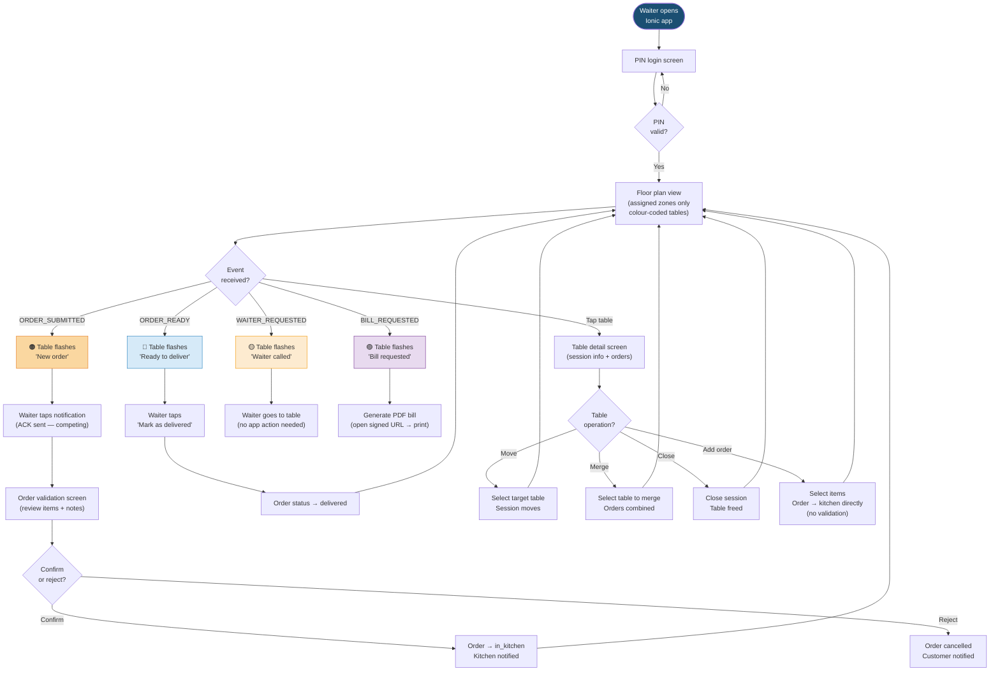

# Sprint 7 — Waiter App Interaction Flow

```mermaid
flowchart TD
    START(["Waiter opens\nIonic app"]) --> PIN["PIN login screen"]
    PIN --> AUTH{PIN\nvalid?}
    AUTH -->|No| PIN
    AUTH -->|Yes| FLOORPLAN["Floor plan view\n(assigned zones only\ncolour-coded tables)"]

    FLOORPLAN --> IDLE{Event\nreceived?}

    IDLE -->|ORDER_SUBMITTED| NOTIF_ORDER["🟠 Table flashes\n'New order'"]
    IDLE -->|WAITER_REQUESTED| NOTIF_CALL["🟡 Table flashes\n'Waiter called'"]
    IDLE -->|BILL_REQUESTED| NOTIF_BILL["🟣 Table flashes\n'Bill requested'"]
    IDLE -->|ORDER_READY| NOTIF_READY["🔵 Table flashes\n'Ready to deliver'"]
    IDLE -->|Tap table| TABLE_DETAIL["Table detail screen\n(session info + orders)"]

    NOTIF_ORDER --> TAP_ORDER["Waiter taps notification\n(ACK sent — competing)"]
    TAP_ORDER --> VALIDATE["Order validation screen\n(review items + notes)"]
    VALIDATE --> CONFIRM{Confirm\nor reject?}
    CONFIRM -->|Confirm| SEND_KITCHEN["Order → in_kitchen\nKitchen notified"]
    CONFIRM -->|Reject| CANCEL["Order cancelled\nCustomer notified"]

    NOTIF_READY --> TAP_DELIVER["Waiter taps\n'Mark as delivered'"]
    TAP_DELIVER --> DELIVERED["Order status → delivered"]

    NOTIF_CALL --> GO_TABLE["Waiter goes to table\n(no app action needed)"]
    NOTIF_BILL --> GENERATE["Generate PDF bill\n(open signed URL → print)"]

    TABLE_DETAIL --> OPS{Table\noperation?}
    OPS -->|Move| MOVE["Select target table\nSession moves"]
    OPS -->|Merge| MERGE["Select table to merge\nOrders combined"]
    OPS -->|Close| CLOSE["Close session\nTable freed"]
    OPS -->|Add order| ORDER_DIRECT["Select items\nOrder → kitchen directly\n(no validation)"]

    SEND_KITCHEN & DELIVERED & MOVE & MERGE & CLOSE & ORDER_DIRECT --> FLOORPLAN

    style START fill:#1B4F72,color:#fff
    style NOTIF_ORDER fill:#FAD7A0,stroke:#E67E22
    style NOTIF_CALL fill:#FDEBD0,stroke:#F39C12
    style NOTIF_BILL fill:#E8DAEF,stroke:#7D3C98
    style NOTIF_READY fill:#D6EAF8,stroke:#2E86C1
```
