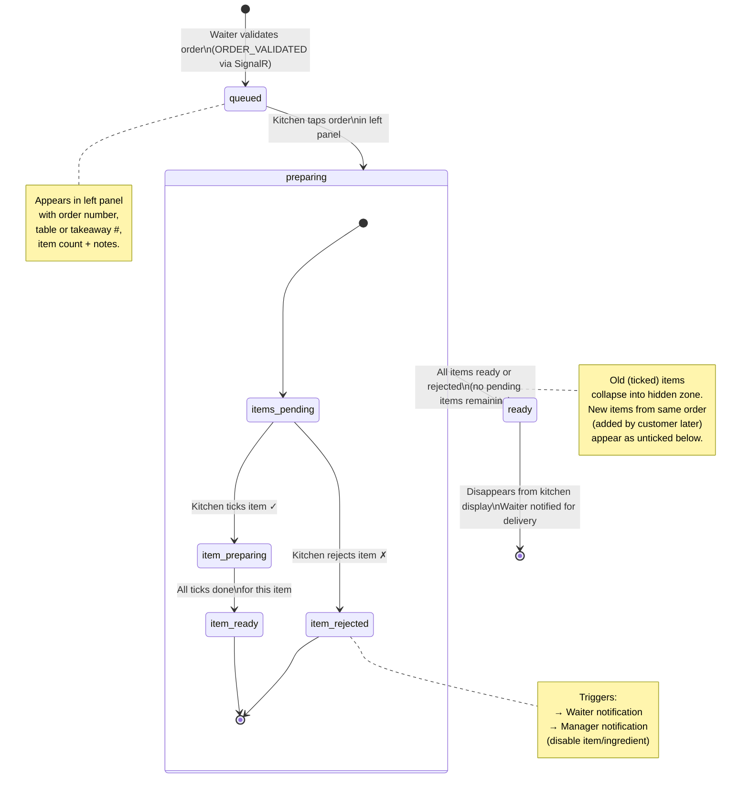

# Sprint 8 — Kitchen Display State Machine

```mermaid
stateDiagram-v2
    [*] --> queued : Waiter validates order\n(ORDER_VALIDATED via SignalR)

    queued --> preparing : Kitchen taps order\nin left panel

    state preparing {
        [*] --> items_pending
        items_pending --> item_preparing : Kitchen ticks item ✓
        item_preparing --> item_ready : All ticks done\nfor this item
        item_ready --> [*]
        items_pending --> item_rejected : Kitchen rejects item ✗
        item_rejected --> [*]
    }

    preparing --> ready : All items ready or rejected\n(no pending items remaining)
    ready --> [*] : Disappears from kitchen display\nWaiter notified for delivery

    note right of queued
        Appears in left panel
        with order number,
        table or takeaway #,
        item count + notes.
    end note

    note right of preparing
        Old (ticked) items
        collapse into hidden zone.
        New items from same order
        (added by customer later)
        appear as unticked below.
    end note

    note right of item_rejected
        Triggers:
        → Waiter notification
        → Manager notification
        (disable item/ingredient)
    end note
```
