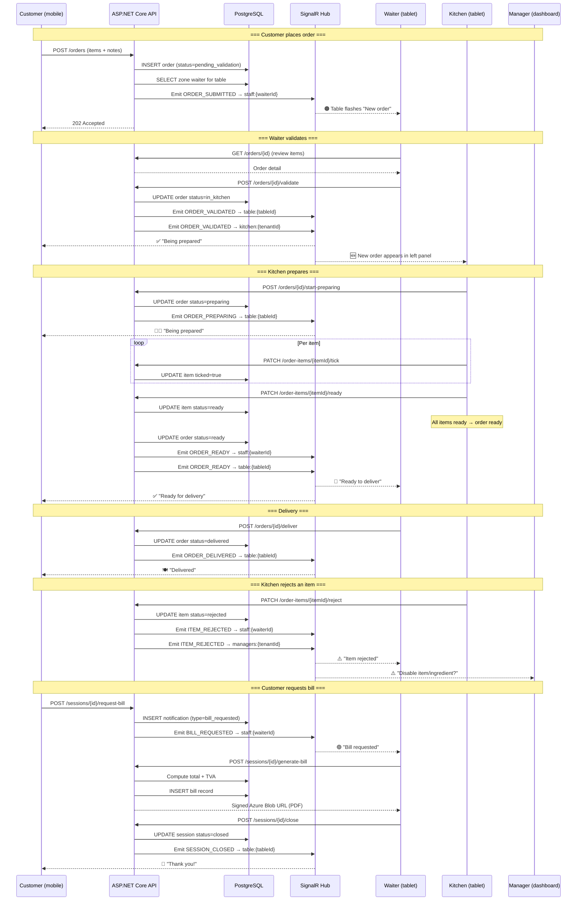

# Sprint 8 — Full System Simulation (All Roles)

```mermaid
sequenceDiagram

    participant C as Customer (mobile)
    participant API as ASP.NET Core API
    participant DB as PostgreSQL
    participant SIG as SignalR Hub
    participant W as Waiter (tablet)
    participant K as Kitchen (tablet)
    participant M as Manager (dashboard)

    Note over C,M: === Customer places order ===

    C->>API: POST /orders (items + notes)
    API->>DB: INSERT order (status=pending_validation)
    API->>DB: SELECT zone waiter for table
    API->>SIG: Emit ORDER_SUBMITTED → staff:{waiterId}
    SIG-->>W: 🟠 Table flashes "New order"
    API-->>C: 202 Accepted

    Note over C,M: === Waiter validates ===

    W->>API: GET /orders/{id} (review items)
    API-->>W: Order detail
    W->>API: POST /orders/{id}/validate
    API->>DB: UPDATE order status=in_kitchen
    API->>SIG: Emit ORDER_VALIDATED → table:{tableId}
    API->>SIG: Emit ORDER_VALIDATED → kitchen:{tenantId}
    SIG-->>C: ✅ "Being prepared"
    SIG-->>K: 🆕 New order appears in left panel

    Note over C,M: === Kitchen prepares ===

    K->>API: POST /orders/{id}/start-preparing
    API->>DB: UPDATE order status=preparing
    API->>SIG: Emit ORDER_PREPARING → table:{tableId}
    SIG-->>C: 👨‍🍳 "Being prepared"

    loop Per item
        K->>API: PATCH /order-items/{itemId}/tick
        API->>DB: UPDATE item ticked=true
    end

    K->>API: PATCH /order-items/{itemId}/ready
    API->>DB: UPDATE item status=ready

    Note over K: All items ready → order ready

    API->>DB: UPDATE order status=ready
    API->>SIG: Emit ORDER_READY → staff:{waiterId}
    API->>SIG: Emit ORDER_READY → table:{tableId}
    SIG-->>W: 🔵 "Ready to deliver"
    SIG-->>C: ✅ "Ready for delivery"

    Note over C,M: === Delivery ===

    W->>API: POST /orders/{id}/deliver
    API->>DB: UPDATE order status=delivered
    API->>SIG: Emit ORDER_DELIVERED → table:{tableId}
    SIG-->>C: 🍽️ "Delivered"

    Note over C,M: === Kitchen rejects an item ===

    K->>API: PATCH /order-items/{itemId}/reject
    API->>DB: UPDATE item status=rejected
    API->>SIG: Emit ITEM_REJECTED → staff:{waiterId}
    API->>SIG: Emit ITEM_REJECTED → managers:{tenantId}
    SIG-->>W: ⚠️ "Item rejected"
    SIG-->>M: ⚠️ "Disable item/ingredient?"

    Note over C,M: === Customer requests bill ===

    C->>API: POST /sessions/{id}/request-bill
    API->>DB: INSERT notification (type=bill_requested)
    API->>SIG: Emit BILL_REQUESTED → staff:{waiterId}
    SIG-->>W: 🟣 "Bill requested"

    W->>API: POST /sessions/{id}/generate-bill
    API->>DB: Compute total + TVA
    API->>DB: INSERT bill record
    API-->>W: Signed Azure Blob URL (PDF)

    W->>API: POST /sessions/{id}/close
    API->>DB: UPDATE session status=closed
    API->>SIG: Emit SESSION_CLOSED → table:{tableId}
    SIG-->>C: 👋 "Thank you!"
```
