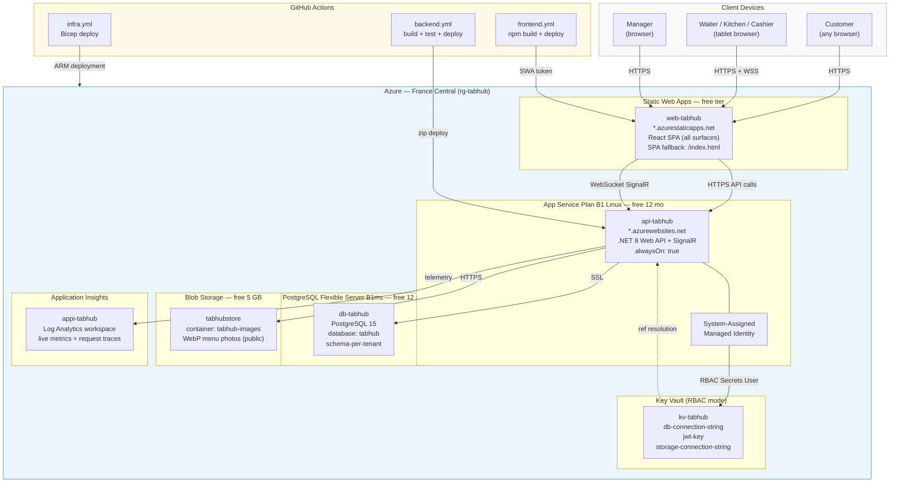

# Sprint 9 — Azure Infrastructure Topology

All resources deployed to **France Central** under `rg-tabhub`.
No custom domain — Azure free subdomains used throughout the demo period.
Path-based tenant routing (`/manager/:tenant/...`, `/waiter/:tenant`, etc.) — no wildcard DNS needed.



## Key Vault secrets flow (no credentials in code)

```
App Service managed identity
  → RBAC "Key Vault Secrets User" on kv-tabhub
  → App Settings use Key Vault references (resolved at runtime):
      ConnectionStrings__Default     → db-connection-string
      Jwt__Key                       → jwt-key
      AzureStorage__ConnectionString → storage-connection-string
```

## Resource names (derived from namePrefix = "tabhub")

| Azure resource | Name | Public URL |
|---|---|---|
| App Service | `api-tabhub` | `api-tabhub.azurewebsites.net` |
| Static Web App | `web-tabhub` | `web-tabhub.azurestaticapps.net` |
| PostgreSQL | `db-tabhub` | `db-tabhub.postgres.database.azure.com` |
| Storage | `tabhubstore` | `tabhubstore.blob.core.windows.net` |
| Key Vault | `kv-tabhub` | `kv-tabhub.vault.azure.net` |
| App Insights | `appi-tabhub` | Azure Portal |
