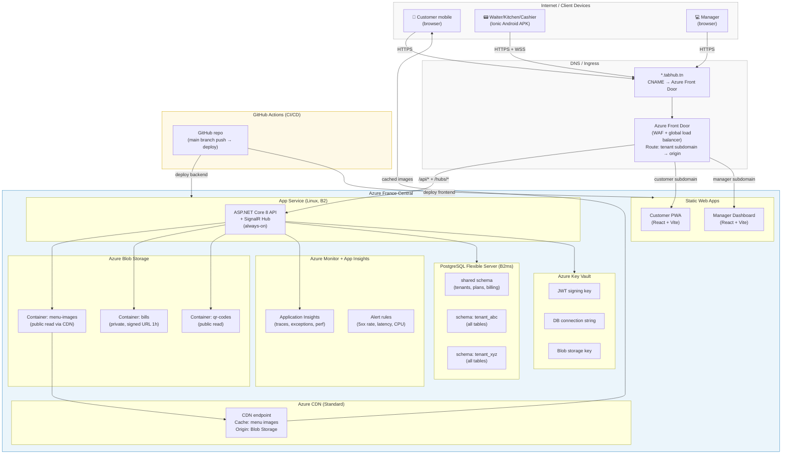

# Sprint 9 — Azure Infrastructure Topology

```mermaid
flowchart TD
    subgraph Internet["Internet / Client Devices"]
        MOB["📱 Customer mobile\n(browser)"]
        TAB["📟 Waiter/Kitchen/Cashier\n(Ionic Android APK)"]
        MGR["💻 Manager\n(browser)"]
    end

    subgraph DNS["DNS / Ingress"]
        CNAME["*.tabhub.tn\nCNAME → Azure Front Door"]
        AFD["Azure Front Door\n(WAF + global load balancer)\nRoute: tenant subdomain → origin"]
    end

    subgraph FranceCentral["Azure France Central"]

        subgraph StaticWeb["Static Web Apps"]
            SWA_CUST["Customer PWA\n(React + Vite)"]
            SWA_MGR["Manager Dashboard\n(React + Vite)"]
        end

        subgraph AppService["App Service (Linux, B2)"]
            API["ASP.NET Core 8 API\n+ SignalR Hub\n(always-on)"]
        end

        subgraph Storage["Azure Blob Storage"]
            BLOB_IMG["Container: menu-images\n(public read via CDN)"]
            BLOB_BILL["Container: bills\n(private, signed URL 1h)"]
            BLOB_QR["Container: qr-codes\n(public read)"]
        end

        subgraph CDN["Azure CDN (Standard)"]
            CDN_NODE["CDN endpoint\nCache: menu images\nOrigin: Blob Storage"]
        end

        subgraph DB["PostgreSQL Flexible Server (B2ms)"]
            PG_SHARED["shared schema\n(tenants, plans, billing)"]
            PG_T1["schema: tenant_abc\n(all tables)"]
            PG_T2["schema: tenant_xyz\n(all tables)"]
        end

        subgraph KV["Azure Key Vault"]
            SECRET_JWT["JWT signing key"]
            SECRET_DB["DB connection string"]
            SECRET_BLOB["Blob storage key"]
        end

        subgraph MONITOR["Azure Monitor + App Insights"]
            AI["Application Insights\n(traces, exceptions, perf)"]
            ALERTS["Alert rules\n(5xx rate, latency, CPU)"]
        end

    end

    subgraph CICD["GitHub Actions (CI/CD)"]
        GH["GitHub repo\n(main branch push → deploy)"]
    end

    MOB -->|HTTPS| CNAME
    TAB -->|HTTPS + WSS| CNAME
    MGR -->|HTTPS| CNAME
    CNAME --> AFD
    AFD -->|/api/* + /hubs/*| API
    AFD -->|customer subdomain| SWA_CUST
    AFD -->|manager subdomain| SWA_MGR

    API --> DB
    API --> BLOB_IMG
    API --> BLOB_BILL
    API --> BLOB_QR
    API --> KV
    API --> AI

    BLOB_IMG --> CDN_NODE
    CDN_NODE -->|cached images| MOB

    GH -->|deploy backend| AppService
    GH -->|deploy frontend| StaticWeb

    style FranceCentral fill:#EBF5FB,stroke:#2E86C1
    style DNS fill:#F9F9F9,stroke:#AAA
    style CICD fill:#FEF9E7,stroke:#D4AC0D
    style Internet fill:#F9F9F9,stroke:#AAA
```
