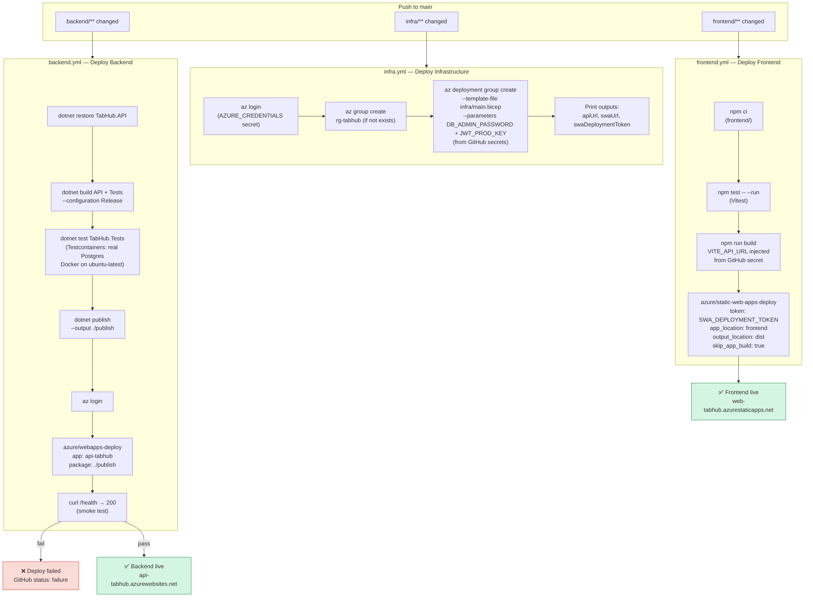

# Sprint 9 — GitHub Actions CI/CD Pipeline

Three independent workflows, each triggered by path filters on `main`.

## GitHub secrets required

| Secret | Used by | Source |
|---|---|---|
| `AZURE_CREDENTIALS` | All 3 workflows | `az ad sp create-for-rbac --sdk-auth` |
| `AZURE_RESOURCE_GROUP` | infra + backend | `rg-tabhub` |
| `AZURE_APP_SERVICE_NAME` | backend | `api-tabhub` |
| `DB_ADMIN_PASSWORD` | infra | Strong password (min 8 chars) |
| `JWT_PROD_KEY` | infra | Random string min 32 chars |
| `SWA_DEPLOYMENT_TOKEN` | frontend | Output of first infra deploy |
| `VITE_API_URL` | frontend | `https://api-tabhub.azurewebsites.net` |
