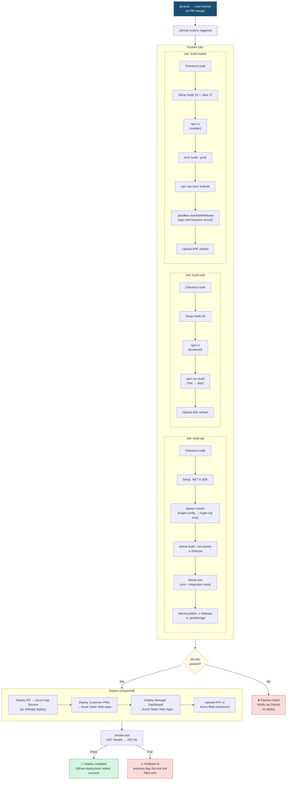

# Sprint 9 — GitHub Actions CI/CD Pipeline

```mermaid
flowchart TD
    PUSH["git push → main branch\n(or PR merge)"]

    PUSH --> TRIGGER["GitHub Actions triggered"]

    TRIGGER --> PARALLEL

    subgraph PARALLEL["Parallel jobs"]
        direction LR

        subgraph JOB_API["Job: build-api"]
            A1["Checkout code"]
            A2["Setup .NET 8 SDK"]
            A3["dotnet restore\n(nuget.config → nuget.org only)"]
            A4["dotnet build --no-restore\n-c Release"]
            A5["dotnet test\n(unit + integration tests)"]
            A6["dotnet publish -c Release\n-o ./publish/api"]
            A1 --> A2 --> A3 --> A4 --> A5 --> A6
        end

        subgraph JOB_WEB["Job: build-web"]
            W1["Checkout code"]
            W2["Setup Node 20"]
            W3["npm ci\n(frontend/)"]
            W4["npm run build\n(Vite → dist/)"]
            W5["Upload dist/ artifact"]
            W1 --> W2 --> W3 --> W4 --> W5
        end

        subgraph JOB_MOB["Job: build-mobile"]
            M1["Checkout code"]
            M2["Setup Node 20 + Java 17"]
            M3["npm ci\n(mobile/)"]
            M4["ionic build --prod"]
            M5["npx cap sync android"]
            M6["./gradlew assembleRelease\n(sign with keystore secret)"]
            M7["Upload APK artifact"]
            M1 --> M2 --> M3 --> M4 --> M5 --> M6 --> M7
        end
    end

    PARALLEL --> GATE{All jobs\npassed?}

    GATE -->|No| FAIL["❌ Pipeline failed\nNotify via GitHub\nno deploy"]

    GATE -->|Yes| DEPLOY

    subgraph DEPLOY["Deploy (sequential)"]
        D1["Deploy API → Azure App Service\n(az webapp deploy)"]
        D2["Deploy Customer PWA\n→ Azure Static Web Apps"]
        D3["Deploy Manager Dashboard\n→ Azure Static Web Apps"]
        D4["Upload APK to\nAzure Blob (releases/)"]
        D1 --> D2 --> D3 --> D4
    end

    DEPLOY --> SMOKE["Smoke test\nGET /health → 200 OK"]
    SMOKE -->|Pass| SUCCESS["✅ Deploy complete\nGitHub deployment status: success"]
    SMOKE -->|Fail| ROLLBACK["⚠️ Rollback to\nprevious App Service slot\nAlert sent"]

    style PUSH fill:#1B4F72,color:#fff
    style SUCCESS fill:#D5F5E3,stroke:#1E8449
    style FAIL fill:#FADBD8,stroke:#CB4335
    style ROLLBACK fill:#FADBD8,stroke:#CB4335
    style GATE fill:#FEF9E7,stroke:#D4AC0D
```
